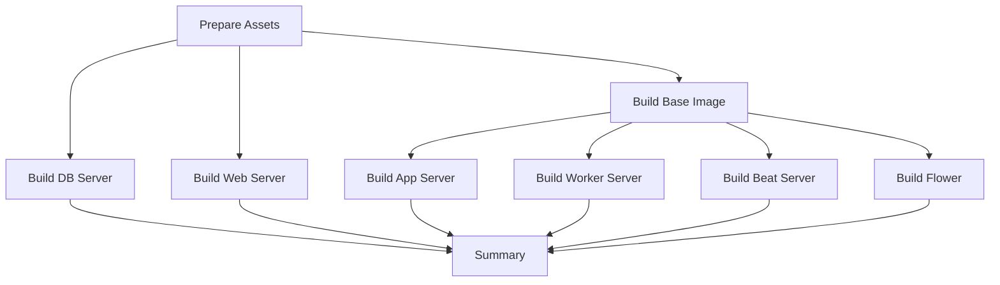

# Docker Direct Build Workflow

## Overview
This workflow builds and pushes Docker images directly on GitHub Actions runners without using Docker Build Cloud.

## Setup Instructions

### 1. Configure GitHub Secrets
You need to add the following secrets in your GitHub repository settings:

1. Go to Settings → Secrets and variables → Actions
2. Add the following repository secrets:
   - `DOCKER_LOGIN` - Your Docker Hub username
   - `DOCKER_PASSWORD` - Your Docker Hub password or access token (recommended)

### 2. Docker Hub Access Token (Recommended)
Instead of using your password, create an access token:
1. Log in to [Docker Hub](https://hub.docker.com)
2. Go to Account Settings → Security
3. Create New Access Token
4. Use this token as `DOCKER_PASSWORD`

## Workflow Features

### Triggers
- **Automatic**: On push to `master` branch
- **Manual**: Via GitHub Actions UI with option to skip pushing

### Docker Images Built
The workflow builds 7 Docker images with optimized parallelization:

**Phase 1 - Base & Independent** (parallel):
- `iplweb/bpp_base` - Base Python/Django image
- `iplweb/bpp_dbserver` - PostgreSQL database
- `iplweb/bpp_webserver` - Nginx web server

**Phase 2 - Dependent** (parallel, after base):
- `iplweb/bpp_appserver` - Main application server
- `iplweb/bpp_workerserver` - Celery worker
- `iplweb/bpp_beatserver` - Celery beat scheduler
- `iplweb/flower` - Celery monitoring

### Performance Optimizations
- **Parallel Builds**: Independent images build simultaneously
- **GitHub Actions Cache**: Docker layer caching
- **Artifact Sharing**: Frontend assets built once, shared across jobs
- **Smart Dependencies**: Only rebuilds what's necessary

### Manual Workflow Dispatch
You can manually trigger the workflow:
1. Go to Actions → "Docker - Direct Build and Push"
2. Click "Run workflow"
3. Choose whether to push images (useful for testing)

## Architecture


## Monitoring
- Check build status in GitHub Actions tab
- Summary report generated after all builds
- Each image tagged with:
  - Version from Makefile (e.g., `202510.1245`)
  - `latest` tag

## Troubleshooting

### Build Failures
- Check GitHub Actions logs for specific error
- Verify Docker Hub credentials are correct
- Ensure base image builds before dependent images

### Push Failures
- Verify `DOCKER_LOGIN` and `DOCKER_PASSWORD` secrets
- Check Docker Hub rate limits
- Ensure you have push permissions to `iplweb` namespace

## Differences from Cloud Build Workflow

| Feature | Cloud Build | Direct Build |
|---------|------------|--------------|
| Build Location | Docker Cloud | GitHub Runners |
| Configuration | Docker Buildx Cloud | Standard Buildx |
| Secrets | Docker Cloud + GitHub | GitHub only |
| Logs | Docker Cloud UI | GitHub Actions |
| Cost | Docker Cloud pricing | GitHub Actions minutes |
| Control | Limited | Full |

## Version Management
Docker image versions are managed in `Makefile`:
```makefile
DOCKER_VERSION="202510.1245"
```

Update this version before building new releases.
