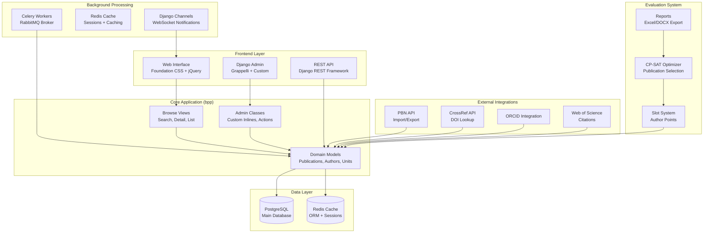
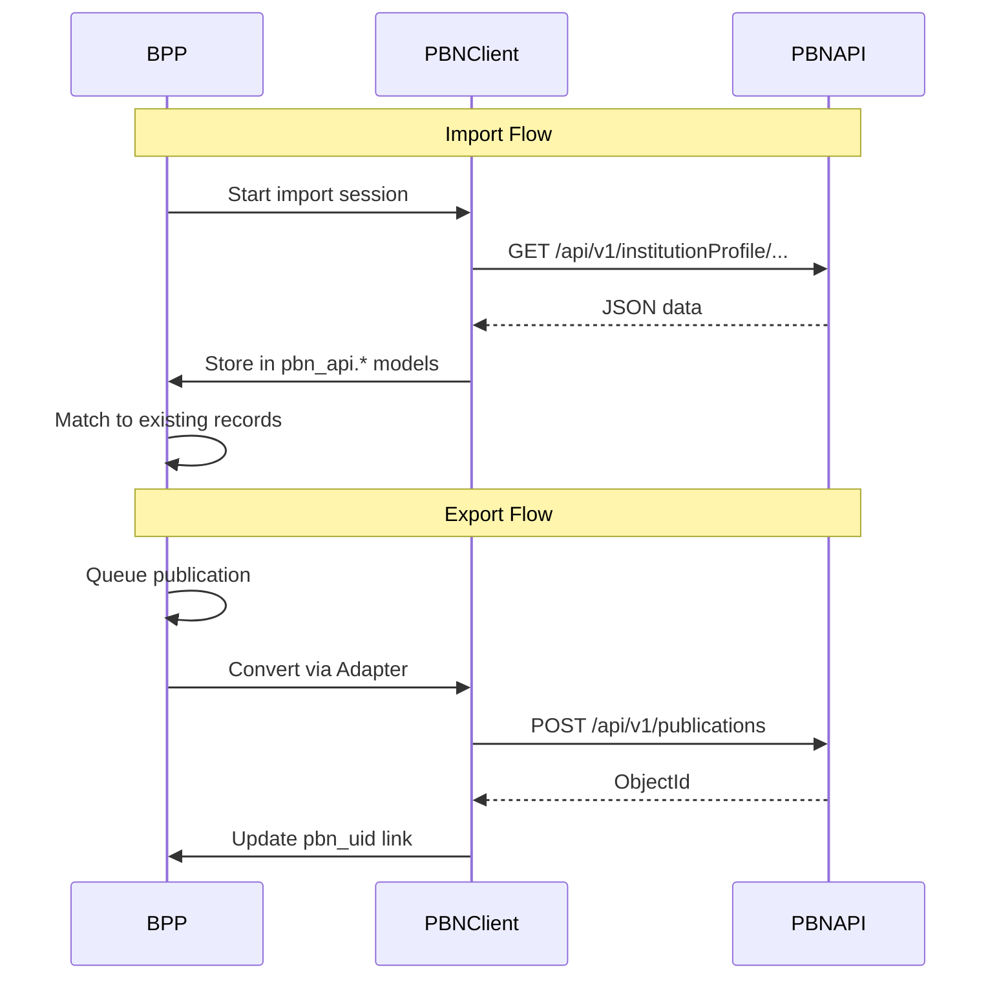
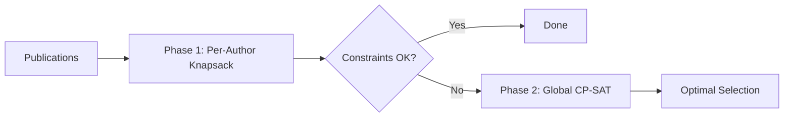
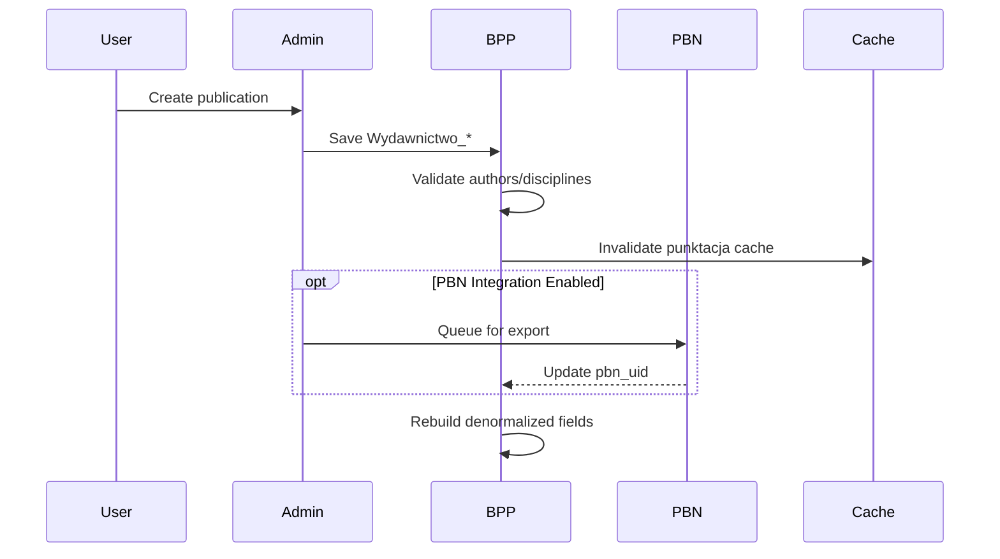
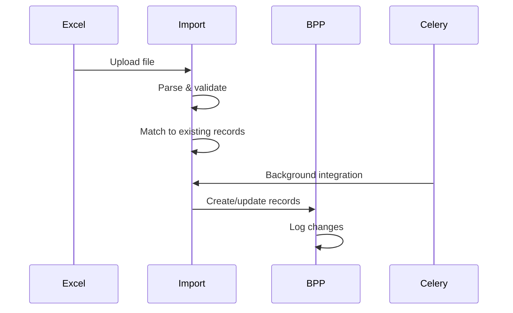

# BPP Codebase Map

> Auto-generated by Cartographer. Last mapped: 2026-01-16

## System Overview

**BPP (Bibliografia Publikacji Pracownikow)** is a comprehensive Polish academic bibliography management system built with Django. It manages publication records, author information, institutional structures, and integrates with external academic databases for Polish universities.



## Technology Stack

| Component | Technology |
|-----------|------------|
| **Backend** | Python 3.10-3.14, Django |
| **Database** | PostgreSQL with custom SQL functions |
| **Cache** | Redis (sessions, ORM caching, locks) |
| **Task Queue** | Celery + RabbitMQ |
| **WebSockets** | Django Channels |
| **Frontend** | Foundation 6 CSS, jQuery, HTMX |
| **Build** | Grunt (SCSS), Yarn (deps), UV (Python) |
| **Admin** | Grappelli skin + extensive customization |
| **API** | Django REST Framework (read-only) |

## Directory Structure

```
bpp/
├── src/                          # Main source code
│   ├── bpp/                      # Core application (1.07M tokens)
│   │   ├── models/               # Domain models (76k tokens)
│   │   ├── admin/                # Admin customizations (57k tokens)
│   │   ├── views/                # Public views (32k tokens)
│   │   ├── templates/            # HTML templates (75k tokens)
│   │   ├── static/               # CSS/JS/images (153k tokens)
│   │   ├── management/           # Management commands (30k tokens)
│   │   ├── migrations/           # Database migrations (340k tokens)
│   │   └── tests/                # Test suite (241k tokens)
│   │
│   ├── django_bpp/               # Project configuration (211k tokens)
│   │   ├── settings/             # Environment-specific settings
│   │   ├── urls.py               # Main URL routing
│   │   └── celery_tasks.py       # Celery configuration
│   │
│   ├── api_v1/                   # REST API (21k tokens)
│   │
│   ├── pbn_*/                    # PBN Integration (~404k tokens total)
│   │   ├── pbn_api/              # API client & models (126k)
│   │   ├── pbn_import/           # Import from PBN (63k)
│   │   ├── pbn_export_queue/     # Export queue (57k)
│   │   └── pbn_integrator/       # Integration utils (56k)
│   │
│   ├── ewaluacja_*/              # Evaluation System (~389k tokens total)
│   │   ├── ewaluacja_optymalizacja/  # Optimization (207k)
│   │   ├── ewaluacja_metryki/        # Metrics (101k)
│   │   ├── ewaluacja_liczba_n/       # N-number calc (49k)
│   │   └── ewaluacja2021/            # 2021 reports (32k)
│   │
│   ├── import_*/                 # Data Import (~100k tokens total)
│   │   ├── import_pracownikow/   # Employee import
│   │   ├── import_dyscyplin/     # Discipline import
│   │   └── import_polon/         # POLON system import
│   │
│   └── [30+ supporting apps]     # Various features
│
├── deploy/                       # Docker & deployment configs
├── docs/                         # Documentation (RST format)
├── bin/                          # Shell scripts & utilities
└── tests/                        # Additional test files
```

## Module Guide

### Core Application (src/bpp/)

**Purpose**: Central domain models, admin interfaces, and public views for bibliography management.

**Key Files**:
| File/Directory | Purpose | Tokens |
|----------------|---------|--------|
| `models/` | Domain models (Author, Publication, Unit, Source) | 76k |
| `models/autor.py` | Author model with employment, disciplines | ~8k |
| `models/wydawnictwo_ciagle.py` | Journal article publications | ~12k |
| `models/wydawnictwo_zwarte.py` | Book/monograph publications | ~10k |
| `models/jednostka.py` | Organizational units (MPTT tree) | ~5k |
| `models/uczelnia.py` | University/institution configuration | ~8k |
| `admin/` | Django admin customizations | 57k |
| `admin/core.py` | Base admin mixins, author inline generator | ~15k |
| `views/browse.py` | Public browse/list/detail views | ~10k |
| `views/autocomplete/` | Select2 autocomplete endpoints | ~8k |

**Domain Model Hierarchy**:
```
Uczelnia (University)
└── Wydzial (Faculty) [optional]
    └── Jednostka (Department/Unit) [MPTT tree]
        └── Autor (Author) [via Autor_Jednostka]
            └── Publications [via *_Autor tables]
                ├── Wydawnictwo_Ciagle (Journal articles)
                ├── Wydawnictwo_Zwarte (Books/chapters)
                ├── Praca_Doktorska (Doctoral thesis)
                ├── Praca_Habilitacyjna (Habilitation)
                └── Patent
```

**Publication Type Inheritance**:
```
RekordBPPBaza (abstract)
├── Wydawnictwo_Baza (abstract)
│   ├── Wydawnictwo_Ciagle
│   ├── Wydawnictwo_Zwarte
│   └── Praca_Doktorska_Baza (abstract)
│       ├── Praca_Doktorska
│       └── Praca_Habilitacyjna
└── Patent
```

---

### PBN Integration (src/pbn_*/)

**Purpose**: Bidirectional synchronization with Polish Bibliography Network (PBN).

**Architecture**:


**Key Components**:
| Module | Purpose |
|--------|---------|
| `pbn_api/client/` | HTTP transport, OAuth flow, API methods |
| `pbn_api/models/` | PBN entity mirrors (Scientist, Publication, Journal) |
| `pbn_api/adapters/` | BPP → PBN JSON conversion |
| `pbn_import/` | Step-based import orchestration with WebSocket progress |
| `pbn_export_queue/` | Background export queue with retry strategies |

**Import Steps** (in order):
1. initial_setup, institution_setup
2. source_import, publisher_import, conference_import
3. author_import, publication_import
4. data_integration, statement_import, fee_import

---

### Evaluation System (src/ewaluacja_*/)

**Purpose**: Polish academic evaluation (2022-2025) with slot-based publication optimization.

**The Slot System**:
- A **slot** represents an author's fractional contribution to a publication
- Authors have **slot limits** (max 4/year, 16 total for 4-year period)
- Institutions have **N-number limits** (3N - sanctions)
- Goal: Maximize institutional points while respecting constraints

**Optimization Algorithm**:


**Key Components**:
| Module | Purpose |
|--------|---------|
| `ewaluacja_optymalizacja/` | Google OR-Tools CP-SAT optimization |
| `ewaluacja_metryki/` | Per-author metric calculation |
| `ewaluacja_liczba_n/` | Slot limits per author/institution |
| `raport_slotow/` | Slot reports and zero-publication authors |

**Constraints Enforced**:
- Per-author slot limits (from `IloscUdzialowDlaAutoraZaCalosc`)
- Institution total slots ≤ 3N - sanctions
- Low-scoring monographs ≤ 20% of total
- Outside-N author slots ≤ 20% of total

---

### Admin System (src/bpp/admin/)

**Purpose**: Highly customized Django admin for data entry staff.

**Key Patterns**:

1. **Dynamic Field Hiding** (`ConstanceScoringFieldsMixin`)
   - Runtime configuration via django-constance
   - Hides scoring fields based on settings

2. **Author Inline Generator** (`generuj_inline_dla_autorow()`)
   - Dynamic form with autocomplete for autor, jednostka, dyscyplina
   - Validates percentage totals ≤ 100%
   - Supports CrossRef API integration

3. **PBN Integration** (`OptionalPBNSaveMixin`)
   - "Save and send to PBN" buttons
   - Background queue for exports

4. **Permission Control**:
   - `RestrictDeletionToAdministracjaGroupMixin`
   - `RestrictDeletionWhenPBNUIDSetMixin`

---

### Supporting Applications

| Application | Purpose | Key Models |
|-------------|---------|------------|
| `zglos_publikacje/` | Publication submission wizard | `Zgloszenie_Publikacji` |
| `oswiadczenia/` | Author declaration generation | `OswiadczeniaExportTask` |
| `deduplikator_autorow/` | Author deduplication | `DuplicateCandidate`, `LogScalania` |
| `import_pracownikow/` | Employee data import | `ImportPracownikow`, `ImportPracownikowRow` |
| `import_dyscyplin/` | Discipline assignment import | `Import_Dyscyplin`, `Kolumna` |
| `crossref_bpp/` | CrossRef DOI lookup | `CrossrefAPICache`, `Komparator` |
| `notifications/` | WebSocket notifications | `Notification`, `NotificationsConsumer` |
| `ranking_autorow/` | Author rankings | Ranking views and calculations |
| `nowe_raporty/` | Modern reporting interface | Report forms and exports |

---

## Data Flow

### Publication Entry Flow


### Import Data Flow


---

## Conventions

### Naming Conventions
- **Models**: PascalCase, Polish names (`Wydawnictwo_Ciagle`, `Autor_Jednostka`)
- **Fields**: snake_case, Polish (`tytul_oryginalny`, `punkty_kbn`)
- **Views**: PascalCase with View suffix (`AutorzyView`, `PracaViewBySlug`)
- **Admin**: ModelAdmin suffix (`AutorAdmin`, `Wydawnictwo_CiagleAdmin`)

### Code Patterns
- **Abstract Models**: Located in `bpp/models/abstract/` for field sharing
- **Admin Mixins**: Located in `bpp/admin/helpers/` for reuse
- **Autocomplete**: Uses django-autocomplete-light (dal) with Select2
- **Caching**: 1-hour cache for view contexts, filter counts

### Testing
- **Framework**: pytest with Django plugin
- **Data Generation**: model_bakery (`baker.make()`)
- **Selenium**: Firefox driver for browser tests
- **Convention**: Standalone functions, no unittest.TestCase

---

## Gotchas

### Critical Rules
1. **NEVER modify existing migrations** - Create new ones only
2. **ALWAYS use `uv run python`** - Never run python directly
3. **Max line length: 88 characters** - Enforced by ruff
4. **Pre-commit: No arguments** - Just `pre-commit`, never `--all-files`

### Performance Considerations
- Full test suite takes **UP TO 10 MINUTES**
- Use `--reuse-db` (default) for faster test runs
- Admin filter counts use HTMX lazy loading with caching
- Large imports use Celery background tasks

### Authentication
- LDAP and Microsoft Auth are **mutually exclusive**
- Session timeout configured via session_security
- Password policies enforced (30 days, 12 history)

### PBN Integration
- 403 errors require user re-authorization
- "Prace serwisowe" (maintenance) triggers retry delays
- Export queue has retry strategies with exponential backoff

---

## Navigation Guide

### To add a new publication type:
1. Create model in `src/bpp/models/` inheriting from `Wydawnictwo_Baza`
2. Create author linking model inheriting from `BazaModeluOdpowiedzialnosciAutorow`
3. Create admin class with author inline
4. Add to `MODELE_PUNKTOWANE` if scored
5. Create migration, update tests

### To add a new admin field:
1. Add field to model
2. Add to fieldset in admin class (or `bpp/admin/helpers/fieldsets.py`)
3. If constance-controlled, update `ConstanceScoringFieldsMixin`
4. Create migration

### To add a new import type:
1. Create app in `src/import_*/`
2. Create models for import session and rows
3. Create views with Excel parsing
4. Add URL patterns to `django_bpp/urls.py`
5. Optionally add Celery tasks for background processing

### To modify PBN integration:
1. API client: `src/pbn_api/client/`
2. Data models: `src/pbn_api/models/`
3. Adapters (BPP→PBN): `src/pbn_api/adapters/`
4. Import steps: `src/pbn_import/utils/step_definitions.py`
5. Export queue: `src/pbn_export_queue/models.py`

### To add evaluation features:
1. Metrics: `src/ewaluacja_metryki/`
2. Optimization: `src/ewaluacja_optymalizacja/core/`
3. Slot limits: `src/ewaluacja_liczba_n/models.py`
4. Reports: `src/nowe_raporty/` or `src/raport_slotow/`

---

## Key URLs

| URL Pattern | View | Purpose |
|-------------|------|---------|
| `/bpp/` | UczelniaView | Homepage |
| `/bpp/autorzy/` | AutorzyView | Author listing |
| `/bpp/autor/<slug>/` | AutorView | Author detail |
| `/bpp/rekord/<slug>/` | PracaViewBySlug | Publication detail |
| `/admin/` | Django Admin | Data management |
| `/api/v1/` | REST API | Read-only API |
| `/multiseek/` | Multiseek | Advanced search |
| `/pbn_import/` | ImportDashboard | PBN import interface |

---

## Environment Variables

Key environment variables (via `.env`):
```
DJANGO_BPP_DB_NAME, DJANGO_BPP_DB_USER, DJANGO_BPP_DB_PASSWORD
DJANGO_BPP_DB_HOST, DJANGO_BPP_DB_PORT
DJANGO_BPP_REDIS_HOST, DJANGO_BPP_REDIS_PORT
DJANGO_BPP_RABBITMQ_HOST, DJANGO_BPP_RABBITMQ_USER
DJANGO_BPP_SECRET_KEY
DJANGO_BPP_ROLLBAR_TOKEN (optional)
MICROSOFT_AUTH_CLIENT_ID (optional)
AUTH_LDAP_SERVER_URI (optional)
```

---

## Quick Reference

### Common Commands
```bash
# Development server
uv run python src/manage.py runserver

# Run tests
uv run pytest src/app_name/tests/

# Database migrations
uv run python src/manage.py migrate

# Django shell
uv run python src/manage.py shell

# Celery worker
uv run celery -A django_bpp.tasks worker

# Frontend build
grunt build
```

### Key Fixtures
- `src/conftest.py` - Global pytest fixtures
- `baker.make(Model)` - Create test objects
- `uczelnia` fixture - Institution with defaults
- `autor` fixture - Author with unit assignment

---

*Map generated by [Cartographer](https://github.com/kingbootoshi/cartographer)*
