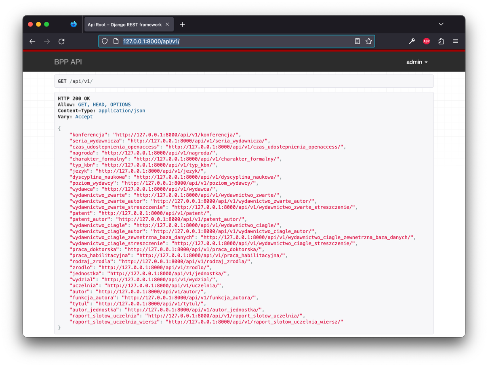

API systemu BPP
===============

System BPP oferuje API tylko-do-odczytu dla obiektów bazodanowych zawierających istotne informacje takie jak: wydawnictwa ciągłe,
wydawnictwa zwarte, patenty, autorzy, jednostki i inne.

API dostępne jest dla użytkowników niezalogowanych.

API dostępne jest w formie "przyjaznej developerom", to znaczy, ze po wejściu w nie możemy
korzystając ze zwykłej przeglądarki WWW zapoznać się z udostępnianymi przez API możliwościami
a następnie płynnie przełączyć się w tryb JSON, aby pobierać dane czytelne nieco mniej dla
człowieka, a bardziej dla komputera.

API dla raportów slotu - uczelnia
---------------------------------

BPP umożliwia tworzenie i pobieranie raportu slotów - uczelnia za pomocą API. Taka funkcja
wymaga jednak zalogowania jako użytkownik będący członkiem grupy "generowanie raportów".

#. Aby utworzyć raport slotów - uczelnia przez API, należy wejść w przeglądarce na stronę:

    ``/api/v1/raport_slotow_uczelnia/``

   Przeglądarka poprosi nas o zalogowanie się za pomoca loginu i hasła. Na samym dole
   strony zobaczymy formularz, który umożliwia utworzenie raportu przez API:

   .. image:: images/api/api_2.png

#. Aby utworzyć raport slotów - uczelnia przez API za pomocą polecenia ``curl(1)``,
   możemy w systemowej powłoce napisać:

    .. code-block:: shell

      curl -X POST -u login:haslo https://adres.serwera/api/v1/raport_slotow_uczelnia/

#. Zwrotnie otrzymamy kod JSON z danymi raportu:

    .. code-block:: json

        {
            "id": "https://adres.serwera/api/v1/raport_slotow_uczelnia/c9d4b477-4cc5-4922-a499-fce43fd37be1/",
            "created_on": "2023-02-21T23:25:36.864007+01:00",
            "last_updated_on": "2023-02-21T23:25:36.864018+01:00",
            "started_on": null,
            "finished_on": null,
            "finished_successfully": false,
            "od_roku": 2023,
            "do_roku": 2023,
            "akcja": "slot",
            "slot": "1.0000",
            "minimalny_pk": "0.00",
            "dziel_na_jednostki_i_wydzialy": true,
            "pokazuj_zerowych": false
        }

   W powyższym przykładzie dana nas interesująca to numer ID raportu, czyli w tym przykładzie
   będzie to ``c9d4b477-4cc5-4922-a499-fce43fd37be1``.

#. Dane raportu zwracane są asynchronicznie. Oznacza to, że dopóki raport nie otrzyma wartości
   w polach ``finished_successfully`` oraz ``finished_on``, oznacza to, że nie jest jeszcze
   utworzony. Należy cyklicznie odświeżać dane raportu np co 5-10 sekund, aż pojawi się
   wartość w tych polach:

   ``curl -u login:haslo https://adres.serwera/api/v1/raport_slotow_uczelnia/c9d4b477-4cc5-4922-a499-fce43fd37be1/``

    .. warning::

     Utworzenie zbyt dużej ilości raportów na raz skutecznie zapcha kolejkę przetwarzania
     asynchronicznego i utrudni kolejnym użytkownikom korzystanie z serwera.

#. Następnie możliwe będzie pobranie pojedynczych wierszy tego raportu. Przez stronę WWW
   potrzebne będzie doklikanie się do strony:

   ``/api/v1/raport_slotow_uczelnia_wiersz/?parent=c9d4b477-4cc5-4922-a499-fce43fd37be1``

   Jak łatwo zauważyć, będzie tam lista wierszy raportu, zawierająca informacje o autorze, jednostce,
   dyscyplinie, zebranym slocie i sumie PkD dla autora.

   .. image:: images/api/api_3.png

   Zapytanie o te wszystkie dane z pomocą polecenia ``curl(1)`` zwróci nam tekst w
   formacie JSON:

   ``curl -u login:haslo "https://adres.serwera/api/v1/raport_slotow_uczelnia_wiersz/?parent=c9d4b477-4cc5-4922-a499-fce43fd37be1" | python -m json.tool``

   **UWAGA**: tutaj na końcu nie dajemy slash.

#. dane w formacie JSON są stronnicowane, po kilka wpisów na stronę, aby nie przeciążać serwera. Warto zwrócić
   uwagę na parametry ``count``, ``next`` i ``previous``, znajdujące się w słowniku.
