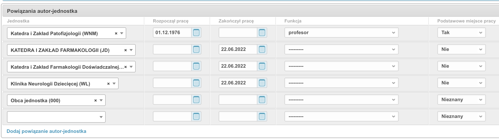

Edycja danych autorów
=====================

Pole *Aktualne miejsce pracy* dla autora
----------------------------------------

Wartość pola *Aktualne miejsce pracy* która widnieje w module redagowania
dla Autora jest wartością tylko-do-odczytu a jej wartość obliczana jest na podstawie
wpisów powiązań autora z jednostką:

.. note:: Pole *Aktualne miejsce pracy* używane jest w raportach oraz do
    podpowiadania jednostki przy dopisywaniu autora do rekordu publikacji.

Algorytm ustalania aktualnego miejsca pracy działa w sposób następujący:

#. jeżeli któreś z miejsc pracy ma atrybut *Podstawowe miejce pracy* ustawiony na "TAK" i data
   zakończenia pracy jest pusta lub większa od obecnej, to takie miejsce będzie wybrane jako aktualne

#. jeżeli autor nie ma żadnego miejsca pracy ustawionego jako podstawowe, to system jako aktualne
   miejsce pracy wybierze to, w którym autor nie zakończył pracy (data zakończenia pracy jest pusta
   lub większa od obecnej) i gdzie autor rozpoczął pracę najpóźniej (data rozpoczęcia pracy jest
   najwyższa)

#. jeżeli autor ma kilka miejsc pracy i w żadnym nie ma ustawionego atrybutu *Podstawowe miejsce pracy*
   oraz daty rozpoczęcia i zakończenia pracy są puste, system jako *Aktualne miejsce pracy* wybierze
   to powiązanie, które do systemu BPP zostało dopisane najpóźniej (jego numer ID jest największy)

.. warning:: dany autor może mieć tylko jedno powiązanie oznaczone jako *Podstawowe miejsce pracy*.
