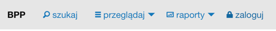
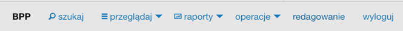
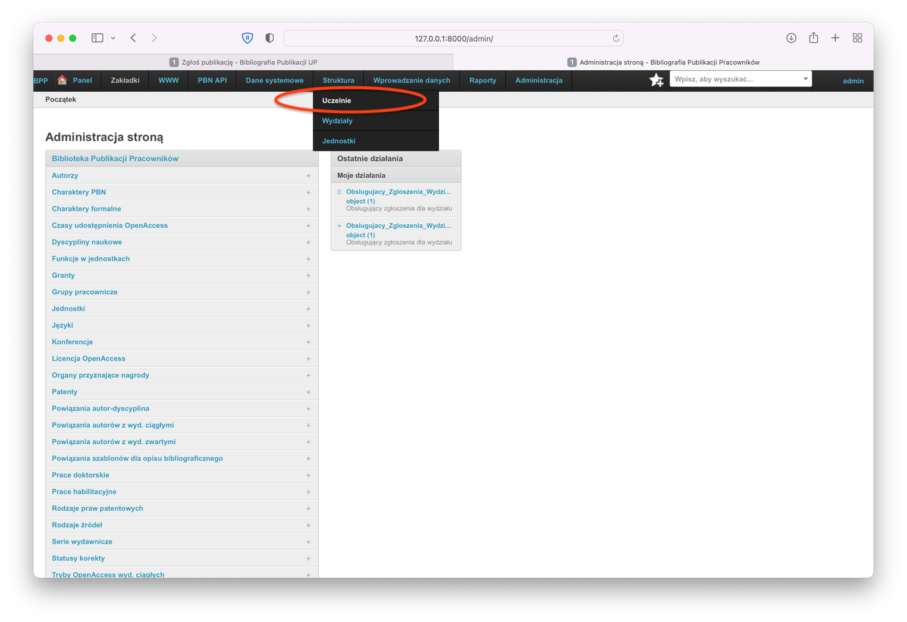
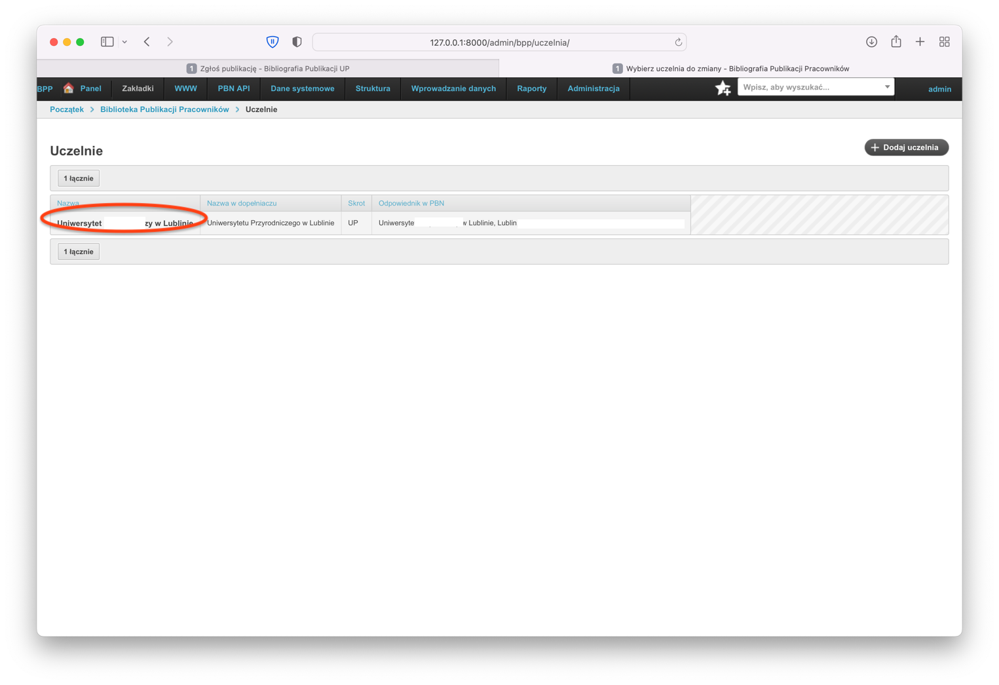
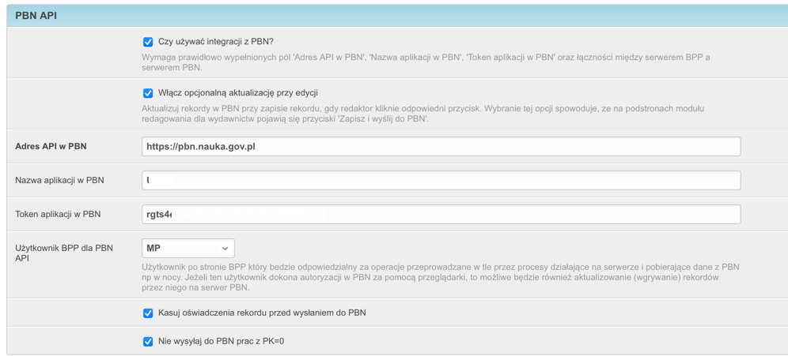

Edycja danych uczelni
=====================

Wejście do ustawień Uczelni
---------------------------

Aby wejść do ustawień Uczelni, musimy najpierw się zalogować do systemu. W tym celu na pierwszym ekranie
na górnej belce nawigacji klikamy w "zaloguj"

Po zalogowaniu się, na górnej belce nawigacji pojawi się opcja "redagowanie":

Po wejściu w redagowanie, z górnej belki nawigacji wybieramy "Struktura" a następnie "Uczelnia":

W systemie powinien być jeden rekord określający dane uczelni. Aby wejśc dalej, klikamy w nazwę Uczelni:

Następnie otworzy nam się puszka Pandory tzn. formularz ustawień uczelni. W chwili tworzenia niniejszej dokumentacji
zajmuje on około 5 ekranów. Użytkownicy końcowi a nawet administratorzy nie będą tu zaglądać zbyt często, ale mimo
to doradzamy rozwagę w edycji ustawień obiektu uczelnia.

Integracja z Web Of Science
---------------------------

Po rozwinięciu zakładki "Clarivate Analytics API" możemy uzupełnić nazwę użytkownika i hasło do Clarivate Analytics
API. W ten sposób będziemy mogli zaciągać liczbę cytowań dla rekordów i autorów.

Integracja z PBN
----------------

Jeżeli w PBN uzyskaliśmy rolę "Menedżer aplikacji", możemy utworzyc token aplikacji i wpisać te dane do BPP. Umożliwi
to autoryzowanie użytkownika loginem w PBN (na głównej stronie, menu operacje -> autoryzuj w PBN) a następnie
możliwe będzie wysyłanie prac do PBN przy ich zapisywaniu. W ten sposób dane publikacji wpisujemy tylko raz (do BPP),
a ręczne ich wysyłanie do PBN nie jest potrzebne.

Obca jednostka
--------------

W systemie BPP powinna znajdować się jedna i wyłącznie jedna *Obca jednostka*.

Jest to taka jednostka, do której trafiają autorzy, którzy afiliują na jednostkę nie będącą w strukturach uczelni.

Aby określić *Obcą jednostkę* należy wejść w module Redagowanie➡Struktura➡Uczelnie, wybrać nasza uczelnię i
następnie wybrać jednostkę w polu *Obca jednostka* i zapisać taki rekord.

.. note:: warto, aby *Obca jednostka* miała odznaczone :ref:`Pole *Skupia pracowników*` oraz :ref:`Pole *Zarządzaj automatycznie*`
