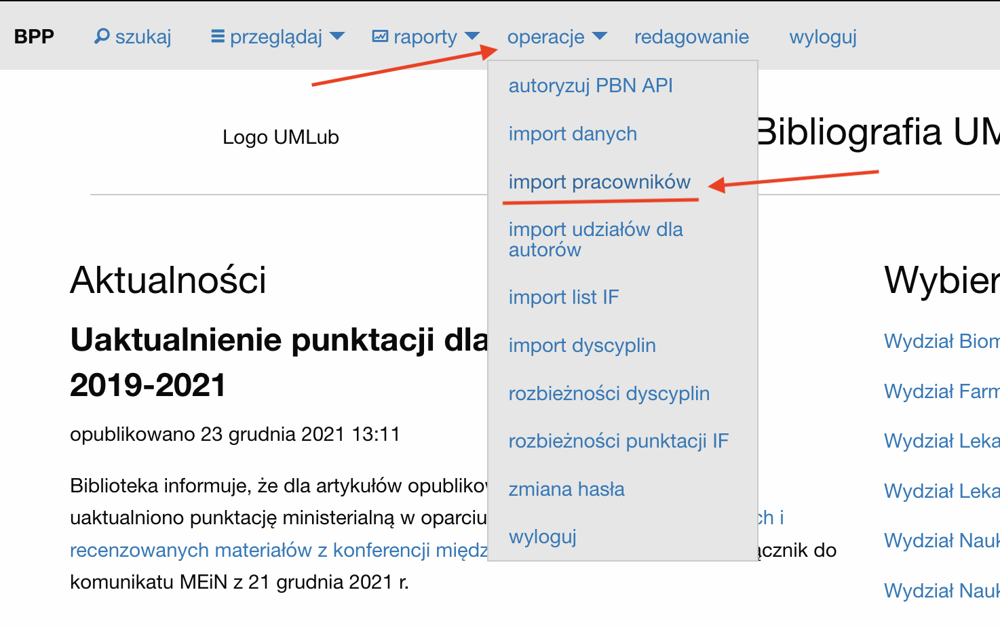
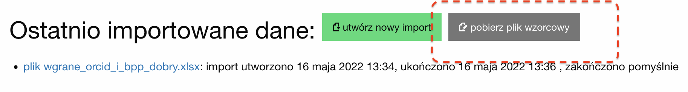
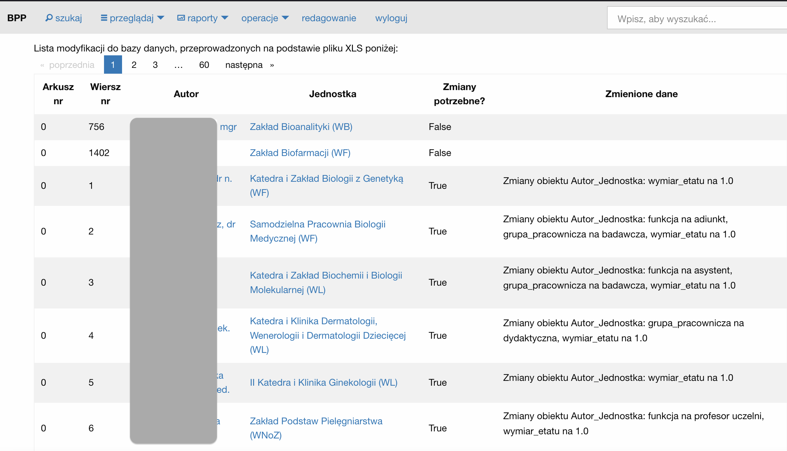
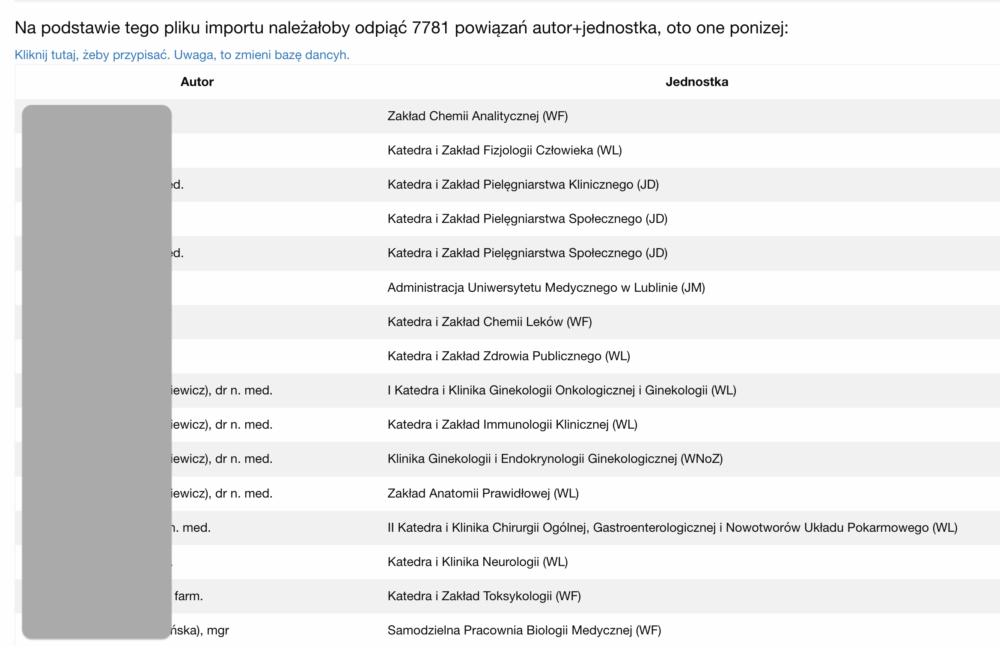

# Import pracowników

Funkcja importu pracowników pozwala zaimportować dane pracowników uczelni
za pomocą pliku w formacie XLS. Domyślnie obsługiwany jest format danych,
który może zostać utworzony przez eksport z oprogramowania [Egeria](https://egeria.comarch.pl) .

## Jak uruchomić?

Aby uruchomić tą funkcję, należy po zalogowaniu się do serwisu z menu
głównego wybrać opcję operacje➡import pracowników.

## Kontrola dostępu

Dostęp do funkcji importu pracowników mają:  
- członkowie grupy *wprowadzanie danych*
- superużytkownicy.

## Przykładowy plik importu

Przykładowy plik importu można pobrać z serwisu BPP klikając w przycisk "pobierz plik wzorcowy"
znajdujący się w opcji importu pracowników. Plik można równiez pozyskać z repozytorium
kodu źródłowego BPP -- [plik wzorcowy na GitHub](https://github.com/iplweb/bpp/blob/dev/src/import_pracownikow/tests/testdata.xlsx).

## Warunki importu danych

Warunkiem importu jest, aby:  
- każda jednostka występująca w pliku XLS miała jeden i tylko jeden pasujący po
  nazwie odpowiednik po stronie systemu BPP,
- każdy autor występujący w pliku XLS miał jeden i tylko jeden pasujący do niego
  odpowiednik, po kodzie ORCID lub po imieniu, nazwisku i tytule.

Import osób rozwiązany jest w ten sposób, ponieważ:  
- format XLS oprogramowania [Egeria](https://egeria.comarch.pl) nie zawiera danych które jednoznacznie identyfikują jednostki,
  stąd dopasowanie odbywa się po nazwie. W sytuacji, gdyby w pliku XLS znajdowały się
  jednostki o choćby minimalnie róznej nazwie, system mógłby nie dopasować ich i utworzyć nowe
  jednostki,
- podobnie z autorami - procedura importu pracowników nie tworzy nowych rekordów dla autorów. W przyszłości
  może pojawić się wersja procedury importu dodająca nowe osoby do systemu.

## Uruchomienie procedury importu po dodaniu pliku

Aby uruchomić procedure importu danych, wystarczy dodać plik do systemu przy pomocy formularza.

!!! info

    Po dodaniu pliku i zatwierdzeniu formularza, procedura importu danych
    rozpocznie się automatycznie.

## Odpinanie nieaktualnych miejsc pracy

Po zaimportowaniu listy pracowników system prezentuje raport z dokonanych zmian.

W sytuacji, gdy w systemie znajdują się osoby, które mają przypisane zatrudnienie w jednostkach,
a miejsca te nie występują w pliku importu danych, system zaproponuje "odpięcie" tych miejsc pracy.
Operacja ta polega na przypisaniu w polu "zakończył pracę" dla danego powiązania Autor+Jednostka
daty poprzedzającej dzień importu danych. Listę tych osób znajdziemy pod raportem z dokonanych zmian:

Powiązania Autor+Jednostka na takiej liście charakteryzują się następującymi cechami:

- nie wystąpiły w pliku importu - jezeli danego powiązania Autor+Jednostka nie ma w pliku importu, uznane zostanie
  ono za nieaktualne.
- powiązanie Autor+Jednostka dotyczy jednostki, która ma zaznaczone
  [pole Zarządzaj automatycznie](edycja_jednostka.md#pole-zarządzaj-automatycznie) na `TAK`
- powiazanie Autor+Jednostka nie dotyczy [obcej jednostki](edycja_uczelnia.md#obca-jednostka)

!!! warning

    W przypadku importowania przez XLS rekordów wyłącznie kilku osób, warto
    **nie** korzystać z opcji odpinania nieaktualnych miejsc pracy, gdyż wówczas odepniemy miejsca pracy
    praktycznie w całej bazie.

!!! note

    procedura "odpinająca" miejsca pracy jest szczególnie przydatna, jeżeli chcemy mieć
    zaktualizowane informacje dla pola — por. [Pole *Aktualne miejsce pracy* dla autora](edycja_autor.md#pole-aktualne-miejsce-pracy-dla-autora)

