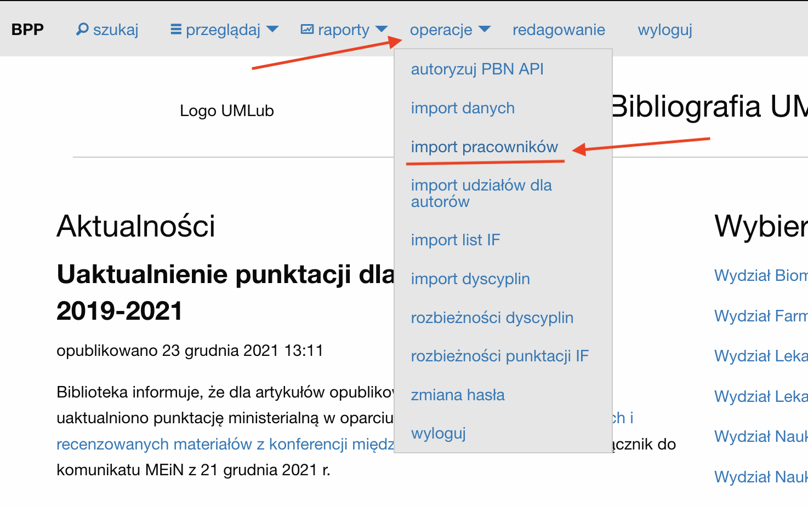
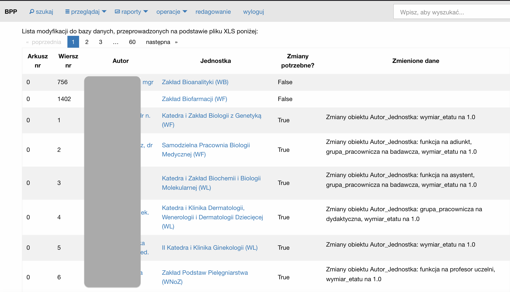
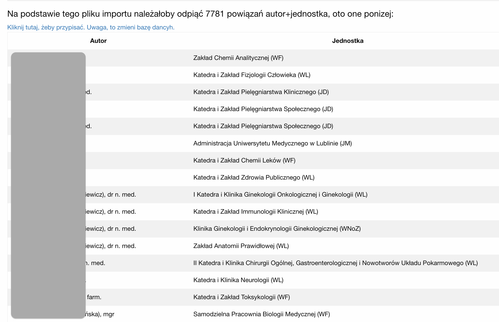

Import pracowników
==================

Funkcja importu pracowników pozwala zaimportować dane pracowników uczelni
za pomocą pliku w formacie XLS. Domyślnie obsługiwany jest format danych,
który może zostać utworzony przez eksport z oprogramowania Egeria_ .

Jak uruchomić?
--------------

Aby uruchomić tą funkcję, należy po zalogowaniu się do serwisu z menu
głównego wybrać opcję operacje➡import pracowników.

Kontrola dostępu
----------------

Dostęp do funkcji importu pracowników mają:
 * członkowie grupy *wprowadzanie danych*
 * superużytkownicy.

Przykładowy plik importu
------------------------

Przykładowy plik importu można pobrać z serwisu BPP klikając w przycisk "pobierz plik wzorcowy"
znajdujący się w opcji importu pracowników. Plik można równiez pozyskać z repozytorium
kodu źródłowego BPP -- `plik wzorcowy na GitHub`_.

|Plik wzorcowy|

.. |Plik wzorcowy| image:: images/import_pracownikow/pobierz_plik_wzorcowy.png
    :alt: Zrzut ekranu przedstawiający przycisk importu pracowników
    :width: 50%

Warunki importu danych
----------------------

Warunkiem importu jest, aby:
 * każda jednostka występująca w pliku XLS miała jeden i tylko jeden pasujący po
   nazwie odpowiednik po stronie systemu BPP,
 * każdy autor występujący w pliku XLS miał jeden i tylko jeden pasujący do niego
   odpowiednik, po kodzie ORCID lub po imieniu, nazwisku i tytule.

Import osób rozwiązany jest w ten sposób, ponieważ:
 * format XLS oprogramowania Egeria_ nie zawiera danych które jednoznacznie identyfikują jednostki,
   stąd dopasowanie odbywa się po nazwie. W sytuacji, gdyby w pliku XLS znajdowały się
   jednostki o choćby minimalnie róznej nazwie, system mógłby nie dopasować ich i utworzyć nowe
   jednostki,
 * podobnie z autorami - procedura importu pracowników nie tworzy nowych rekordów dla autorów. W przyszłości
   może pojawić się wersja procedury importu dodająca nowe osoby do systemu.

Uruchomienie procedury importu po dodaniu pliku
-----------------------------------------------

Aby uruchomić procedure importu danych, wystarczy dodać plik do systemu przy pomocy formularza.

.. important:: Po dodaniu pliku i zatwierdzeniu formularza, procedura importu danych
   rozpocznie się automatycznie.

Odpinanie nieaktualnych miejsc pracy
--------------------------------------

Po zaimportowaniu listy pracowników system prezentuje raport z dokonanych zmian.

W sytuacji, gdy w systemie znajdują się osoby, które mają przypisane zatrudnienie w jednostkach,
a miejsca te nie występują w pliku importu danych, system zaproponuje "odpięcie" tych miejsc pracy.
Operacja ta polega na przypisaniu w polu "zakończył pracę" dla danego powiązania Autor+Jednostka
daty poprzedzającej dzień importu danych. Listę tych osób znajdziemy pod raportem z dokonanych zmian:

Powiązania Autor+Jednostka na takiej liście charakteryzują się następującymi cechami:

* nie wystąpiły w pliku importu - jezeli danego powiązania Autor+Jednostka nie ma w pliku importu, uznane zostanie
  ono za nieaktualne.

* powiązanie Autor+Jednostka dotyczy jednostki, która ma zaznaczone
  :ref:`pole Zarządzaj automatycznie <Pole *Zarządzaj automatycznie*>` na `TAK`

* powiazanie Autor+Jednostka nie dotyczy :ref:`obcej jednostki <Obca jednostka>`

.. warning:: W przypadku importowania przez XLS rekordów wyłącznie kilku osób, warto
   **nie** korzystać z opcji odpinania nieaktualnych miejsc pracy, gdyż wówczas odepniemy miejsca pracy
   praktycznie w całej bazie.

.. note:: procedura "odpinająca" miejsca pracy jest szczególnie przydatna, jeżeli chcemy mieć
    zaktualizowane informacje dla pola -- por. :ref:`Pole *Aktualne miejsce pracy* dla autora`

.. _Egeria: https://egeria.comarch.pl
.. _plik wzorcowy na GitHub: https://github.com/iplweb/bpp/blob/dev/src/import_pracownikow/tests/testdata.xlsx
