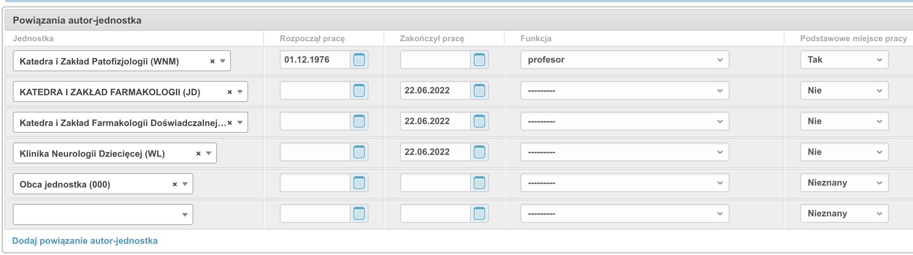

# Edycja danych autorów

## Pole *Aktualne miejsce pracy* dla autora

Wartość pola *Aktualne miejsce pracy* która widnieje w module redagowania
dla Autora jest wartością tylko-do-odczytu a jej wartość obliczana jest na podstawie
wpisów powiązań autora z jednostką:

!!! note

    Pole *Aktualne miejsce pracy* używane jest w raportach oraz do
    podpowiadania jednostki przy dopisywaniu autora do rekordu publikacji.

Algorytm ustalania aktualnego miejsca pracy działa w sposób następujący:

1.  jeżeli któreś z miejsc pracy ma atrybut *Podstawowe miejce pracy* ustawiony na "TAK" i data
    zakończenia pracy jest pusta lub większa od obecnej, to takie miejsce będzie wybrane jako aktualne
2.  jeżeli autor nie ma żadnego miejsca pracy ustawionego jako podstawowe, to system jako aktualne
    miejsce pracy wybierze to, w którym autor nie zakończył pracy (data zakończenia pracy jest pusta
    lub większa od obecnej) i gdzie autor rozpoczął pracę najpóźniej (data rozpoczęcia pracy jest
    najwyższa)
3.  jeżeli autor ma kilka miejsc pracy i w żadnym nie ma ustawionego atrybutu *Podstawowe miejsce pracy*
    oraz daty rozpoczęcia i zakończenia pracy są puste, system jako *Aktualne miejsce pracy* wybierze
    to powiązanie, które do systemu BPP zostało dopisane najpóźniej (jego numer ID jest największy)

!!! warning

    dany autor może mieć tylko jedno powiązanie oznaczone jako *Podstawowe miejsce pracy*.

## Zdjęcie i biogram autora (samodzielna edycja)

Zalogowany użytkownik powiązany ze swoim rekordem autora może **samodzielnie**
zredagować dane prezentowane na jego publicznej
[stronie autora](../uzytkownik/przegladanie-i-wyszukiwanie.md#strona-autora) —
bez pośrednictwa redaktora. Edycji podlegają:

- **biogram** — wpisywany w języku Markdown lub w HTML, z **podglądem na żywo**
  (zmiany widać od razu obok pola edycji),
- **zdjęcie** — wgrane zdjęcie jest automatycznie kadrowane do kwadratu
  i skalowane, zapisywane w formacie WebP; maksymalny rozmiar pliku to 5 MB.

Wejście do edycji: na górnej belce wybierz **„Mój profil"**, a następnie
**„Edytuj swoją stronę"** (adres `/bpp/profil/edycja/`).

!!! note
    Te same pola (zdjęcie i biogram) redaktor może ustawić w module
    redagowania, w rekordzie autora — przydatne, gdy autor nie edytuje
    swoich danych samodzielnie.

## Wyróżnione publikacje autora

Autor może wskazać i uszeregować **wyróżnione prace**, które pojawią się na
początku jego [strony autora](../uzytkownik/przegladanie-i-wyszukiwanie.md#strona-autora)
— pod warunkiem, że uczelnia włączyła sekcję „wyróżnione publikacje" w układzie
podstrony (patrz
[układ podstrony autora](../administrator/ogolna.md#układ-podstrony-autora-profil-autora)).

Listę wyróżnionych prac edytuje się na stronie
`/bpp/profil/edycja/wybrane-publikacje/`:

- wyszukiwarka podpowiada pozycje do dodania,
- prace można **dodawać**, **usuwać** oraz **zmieniać ich kolejność**
  (strzałkami).

!!! note
    Wyszukiwarka podpowiada **wyłącznie własne prace autora** — autor może
    wyróżnić tylko publikacje, z którymi jest powiązany.

