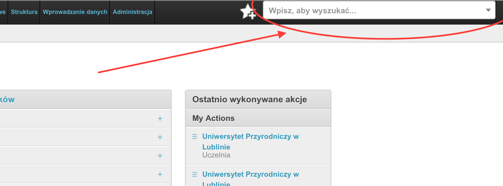
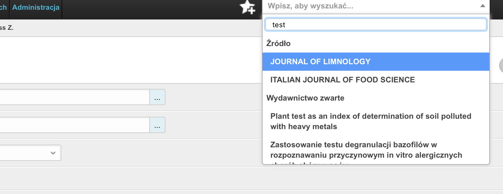
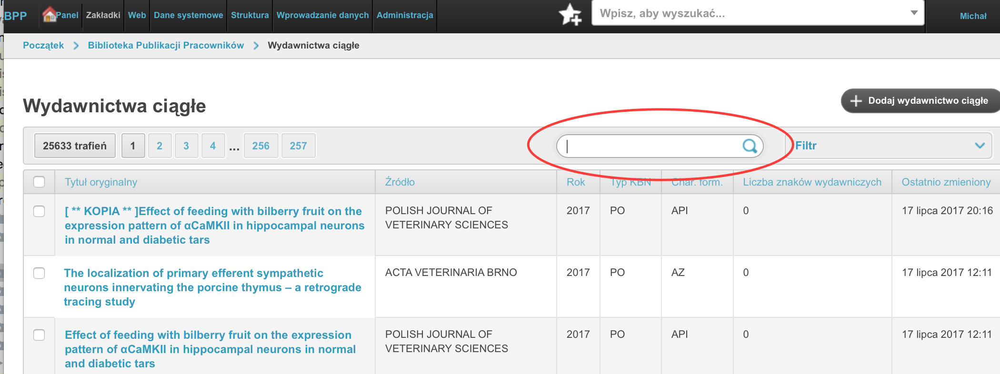
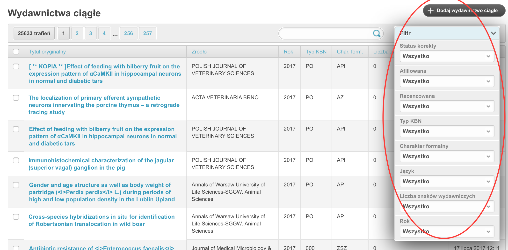
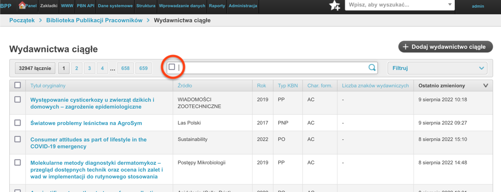
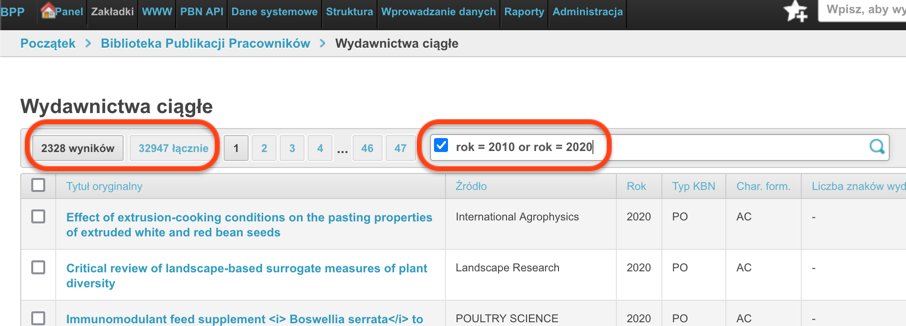
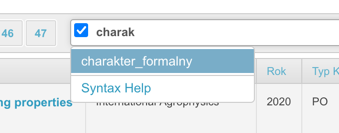
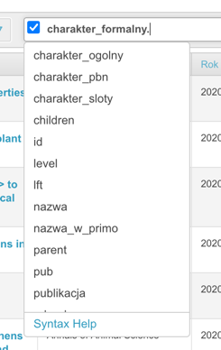
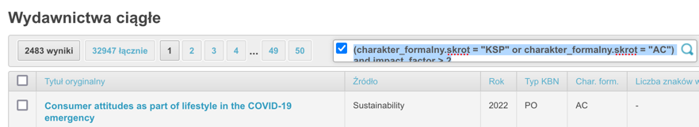
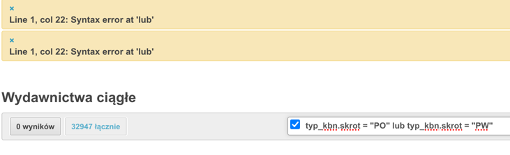

# Wyszukiwanie i filtrowanie rekordów w module Redagowanie

## Wyszukiwanie globalne

Cały moduł Redagowanie, podobnie jak i moduł dla użytkowników niezalogowanych
wyposażony jest w globalne wyszukiwanie. Na górze ekranu znajduje się pole
tekstowe, w które możemy wpisać część tytułu rekordu aby przeszukać jednocześnie
wydawnictwa ciągłe, zwarte, patenty, habilitacje, doktoraty, autorów, jednostki
i źródła. W ten sposób wygodnie można przejść do pożądanego rekordu.



Po wpisaniu ciągu znaków otrzymujemy rozwijaną listę z rekordami różnego rodzaju:



!!! note

    Do tego pola możemy wprowadzić numer ID rekordu aby znaleźć rekord o tym ID.


## Filtrowanie konkretnych tabel

### Filtr tekstowy

Większość tabel w module Redagowanie wyposażona jest w okno filtru tekstowego.
Możemy tam wpisać dowolny ciąg znaków (włącznie z numerem ID), w ten sposób
powodując, ze system wyszuka prace zawierające ten ciąg znaków. Zazwyczaj
przeszukiwane jest pole "tytuł oryginalny", "źródło", "informacje", "szczegóły",
"adnotacje", "rok" ale dla specyficznych tabel mogą być to również inne pola.



### Filtr precyzyjny

Filtrowanie precyzyjne pozwala nam wybrać prace w bardziej szczegółowy sposób,
na podstawie konkretnych pól. Przykładowo, na poniższym rysunku przedstawione są
dostępne filtry dla tabeli "Wydawnictwo ciągłe".



Na poniższym rysunku z kolei przedstawione są przykładowe opcje dla pola "Język".


### Filtrowanie przy pomocy języka zapytań

Część tabel w module Redagowanie umożliwia wyszukiwanie rekordów przy pomocy języka
zapytań [DjangoQL](https://github.com/ivelum/djangoql#language-reference) . Można poznać to po tym, że w polu filtru tekstowego będzie widniała,
domyślnie wyłączona, kontrolka typu "checkbox" - jak na zrzucie ekranu ponizej:



Kontrolka pusta - wyłaczona, oznacza, że filtrowanie DjangoQL jest wyłączone; wyszukiwanie za
pomocą tekstu będzie wyglądało tak, jak opisane w sekcji [Filtr tekstowy](#filtr-tekstowy).

Po włączeniu kontrolki będziemy mieli możliwość wpisania nie tekstu do wyszukania, ale
zapytania w języku [DjangoQL](https://github.com/ivelum/djangoql#language-reference) . Przykładowo, dla tabeli wydawnictw ciągłych chcielibyśmy
wyszukać rekordy opublikowane w roku 2010 lub 2020 powinniśmy wpisać:

``` python
rok = 2010 or rok = 2020
```

Wybór rzecz jasna zatwierdzamy klawiszem ENTER lub klikając w lupę. W rezultacie otrzymujemy wynik wyszukiwania:



Spróbujmy czegoś trudniejszego. Wyszukajmy prace, których impact factor jest większy od 2 i charakter
formalny to artykuł lub ksiażka. Redaktor na pewno zauważy, że podczas pisania tekstu przy włączonym wyszukiwaniu
[DjangoQL](https://github.com/ivelum/djangoql#language-reference) system próbuje podpowiadać nazwy kolumn:



Po wpisaniu kilku znaków więcej i naciśnięciu kropki otrzymujemy podopowiedzi wszystkich pól obiektu
"Charakter formalny", które możemy przeszukac:



Dokończmy nasze zapytanie:

``` python
(charakter_formalny.skrot = "KSP" or charakter_formalny.skrot = "AC") and impact_factor > 2
```

Jak widać na zrzucie ekranu poniżej, zadziałało ono:



Jeżeli wpiszemy zapytanie niepoprawnie, nic się nie stanie. System nie wykona takiego zapytania,
informując nas o błedzie składniowym. Przykładowo gdy zamiast operatora `or` użyjemy polskiego
słowa `lub`, system poinformuje nas o tym w taki sposób:



### Przykładowe zapytania w DjangoQL

#### Rekordy z dyscyplinami

Załózmy, że chcemy odfiltrować wszystkie rekordy z uzupełnionymi dyscyplinami -- rekordy, gdzie przynajmniej
jedna dyscyplina jest uzupełniona.

Z uwagi na sposób w jaki budowane
są zapytania po stronie bazy danych i z uwagi na strukturę danych, zapytanie takie jak poniżej nie da pożądanych
efektów:

``` python
autorzy_set.dyscyplina_naukowa != None
```

To zapytanie znajdzie rekordy, gdzie **wszystkie** dyscypliny są wypełnione - czyli, że każdy podpięty do
rekordu autor ma określoną dyscyplinę; jeżeli przynajmniej jeden autor nie ma dyscypliny, to nie pojawi się
na liście wyników.

Aby wyszukać rekordy z dyscyplinami, gdzie przynajmniej jeden autor ma dyscyplinę, zapytanie można sformułować w taki sposób:

``` python
autorzy_set.dyscyplina_naukowa.nazwa ~ "a"
or autorzy_set.dyscyplina_naukowa.nazwa ~ "i"
```

W ten sposób szukamy prac z dyscypliną naukową zawierającą w nazwie literkę “A” (czyli wszystkie oprócz “rolnictwo i ogrodnictwo”) oraz literkę “I”.

#### Rekordy w źródłach bez odpowiedników w PBN

Aby znaleźć wszystkie wydawnictwa ciągłe, gdzie wpisana jest jakas dyscyplina, a **ich źródło** nie ma odpowiednika PBN,
a rok jest większy lub równy jak 2017, należy dla wydawnictw wpisać taki kod DjangoQL:

``` python
(autorzy_set.dyscyplina_naukowa.nazwa ~ "a"  or autorzy_set.dyscyplina_naukowa.nazwa ~ "i")
and rok >= 2017
and zrodlo.pbn_uid = None
```

Autorzy ukryci, z aktualnym miejscem pracy określonym, innymi niż 'Obca jednostka'
"""""""""""""""""""""""""""""""""""""""""""""""""""""""""""""""""""""""

Aby znaleźć autorów z atrybutem "pokazuj" ustalonym na "nie", z aktualnym miejscem
pracy nie-pustym, ale innym, niż "Obca jednostka", w tabeli autorów wpisujemy następujące
zapytanie DjangoQL:

``` python
pokazuj = False and aktualna_jednostka.nazwa != "Obca jednostka"
and aktualna_jednostka != None
```

#### Źródła bez odpowiednika w PBN, które mają publikacje w roku 2022

Po wejściu w Redagowanie -> Źródła,

``` python
pbn_uid = None and wydawnictwo_ciagle.rok = 2022
```

#### Publikacje za lata 2020-2021 z określonym odpowiednikiem PBN oraz nieokreśloną informacją o płatności

Po wejściu w Redagowanie -> Wydawnictwa ciągłe/zwarte,

``` python
pbn_uid != None and opl_pub_cost_free != None and rok >= 2020 and rok <= 2021
```

#### Autorzy z kół naukowych (SKN) z ukrytymi profilami

Wyszukiwanie autorów z ukrytymi profilami, którzy mają w swoich publikacjach jednostkę zawierającą "SKN"
w nazwie. Przydatne do znalezienia studentów z kół naukowych, którzy mają ukryte profile.

Po wejściu w Redagowanie -> Autorzy, można użyć następujących zapytań:

Wyszukiwanie po ciągu znaków "SKN" w nazwie jednostki:

``` python
autorzy.autor_jednostka.jednostka.nazwa ~ "SKN" and autorzy.pokazuj = False
```

Wyszukiwanie po rodzaju jednostki - koło naukowe (dowolna jednostka wśród jednostek autora):

``` python
autorzy.autor_jednostka.jednostka.rodzaj_jednostki = "kolo_naukowe" and autorzy.pokazuj = False
```

Wyszukiwanie po aktualnej jednostce autora:

``` python
autorzy.aktualna_jednostka.rodzaj_jednostki = "kolo_naukowe" and autorzy.pokazuj = False
```

Przykład zapytania w kontekście publikacji - znajdowanie publikacji ciągłych z autorami z kół naukowych
z ukrytymi profilami. Po wejściu w Redagowanie -> Wydawnictwa ciągłe:

``` python
autorzy.autor_jednostka.jednostka.nazwa ~ "SKN" and autorzy.pokazuj = False
```

#### Operatory logiczne a ich kolejność

Operatory logiczne `and` (czyli po polsku `i`) oraz operator logiczny `or` (czyli po polsku `lub`)
zachowują się podobnie jak mnożenie i dodawanie. Odpowiednikiem mnożenia jest operator `and`, zaś odpowiednikiem
dodawania jest operator `lub`. Oznacza to, że ciąg zapytań `and` jest traktowany jak jedna całość:

``` python
rok = 2020 and charakter_formalny.skrot = "KSP" and impact_factor > 2
```

To zapytanie wyszuka prace z 2020 roku, z charakterem formalnym "KSP" czyli "książka polska" i z impact
factorem większym od 2.

Dołożenie operatora `or` do takiego ciągu zapytań może nie dać dobrych efektów:

``` python
rok = 2020 or rok = 2021 and charakter_formalny.skrot = "KSP" and impact_factor > 2
```

Takie zapytanie znajdzie **wszystkie** rekordy z 2020 roku oraz prace z 2021 roku, z charakterem formalnym
"KSP" czyli "książka polska" i z impact factorem większym od 2. Rekordy z 2020 roku wygenerują się
wszystkie, ponieważ operator `or` działa jak dodawanie. Porównajmy pierwsze zapytanie:

``` python
10 * 20 * 30     # <-- tak możemy przedstawić pierwsze przykładowe zapytanie
# wynik to 6000
```

... a tak drugie:

``` python
10 + 20 * 30 * 40 # <-- tak możemy przedsatwić drugie przykładowe zapytanie
# wynik działań to nie 36000, a 24010...
```

Na pierwszy rzut oka widać, co trzeba zrobić -- dodać nawiasy:

``` python
(rok = 2020 or rok = 2021) and charakter_formalny.skrot = "KSP" and impact_factor > 2
```

Analogicznie w przykładzie matematycznym:

``` python
(10 + 20) * 30 * 40 # wynik to 36000
```

## Samodzielna strona "Wyszukiwanie zapytaniem" (`/zapytanie/`)

Oprócz filtru DjangoQL wbudowanego w listy modułu Redagowanie, dla
zalogowanych redaktorów dostępna jest osobna strona pod adresem
`/zapytanie/` (w menu **szukaj → zapytaniem**). Różni się od filtru
listy tym, że:

- zapytanie wpisuje się raz, niezależnie od konkretnej tabeli — wybiera
  się tylko model (**rekord** albo **autor**), a samo zapytanie DjangoQL
  działa tak samo jak opisano wyżej,
- wynik można pokazać w kilku **postaciach**, wyeksportować w kilku
  formatach oraz zestawić jako **tabelę krzyżową** — czego filtr listy
  w Redagowaniu nie oferuje.

### Postać wyniku

Nad wynikami znajduje się rozwijana lista **Postać wyniku**. Wybór jedzie
razem z zapytaniem — po kliknięciu "Szukaj" URL zawiera parametr
`postac`, więc wynik da się też przesłać jako link czy zapisać w
zakładkach.

Dla modelu **rekord** dostępne są:

- **rekordy (ID + akcje)** — domyślna, dzisiejsza tabela z ID rekordu
  i linkami "Zobacz" / "Edytuj",
- **lista** — numerowana lista opisów bibliograficznych,
- **tabela** — tabela z sumami (impact factor, liczba cytowań, punkty
  KBN, punktacja wewnętrzna),
- **punktacja z wewnętrzną** / **punktacja sumaryczna** — warianty
  tabeli z innym zestawem kolumn punktowych,
- **BibTeX** — lista opisów jako brama do eksportu pliku `.bib`,
- **tabela krzyżowa** — patrz niżej.

Dla modelu **autor** dostępne są tylko **autorzy (ID + akcje)**
(domyślna) i **tabela krzyżowa**.

### Eksport wyników

Pod nagłówkiem wyników pojawia się pasek **Eksport** z linkami do
formatów sensownych dla wybranej postaci i modelu:

- **rekord**: CSV i XLSX zawsze; HTML i DOCX dla postaci innych niż
  tabela krzyżowa; BibTeX (`.bib`) tylko przy postaci **BibTeX**,
- **autor**: CSV i XLSX — kartoteka kadrowa (jednostka, tytuł, stopień,
  ORCID, PBN UID i inne) wraz z metrykami dorobku (liczba prac, Σ
  slotów, Σ pkdaut).

Eksport zawsze obejmuje **cały** wynik zapytania, nie tylko widoczną
stronę wyników. Ze względu na to jest ograniczony limitami: eksport
danych (CSV/XLSX) — maksymalnie 25 000 rekordów, eksport dokumentu
(HTML/DOCX) — maksymalnie 5 000 rekordów. Po przekroczeniu limitu
strona pokazuje komunikat z liczbą trafień i prośbą o zawężenie
zapytania.

### Tabela krzyżowa

Wybranie postaci **tabela krzyżowa** odsłania dodatkowe pola wyboru
wiersza, kolumny i miary macierzy — działa to tak samo, jak tabela
krzyżowa znana z wyszukiwania precyzyjnego (formularzowego), ale liczy
się na wyniku zapytania DjangoQL. Dostępna jest zarówno dla rekordów
(np. rok × charakter formalny, liczba prac albo suma punktów), jak i
dla autorów — w dwóch rodzinach wymiarów:

- **kadrowej** — jednostka, tytuł, stopień, funkcja, płeć, kompletność
  ORCID/PBN/e-mail,
- **bibliometrycznej** — liczba prac, Σ slotów, Σ pkdaut wg roku
  publikacji, dyscypliny, jednostki przy pracy, typu odpowiedzialności
  i charakteru formalnego.

W sekcji pomocy nad formularzem znajdują się gotowe **presety** —
linki, które od razu dokładają wiersz/kolumnę/miarę do bieżącego
zapytania i przełączają postać wyniku na tabelę krzyżową. Samą macierz
(bez surowych wyników) można wyeksportować do CSV i XLSX.
