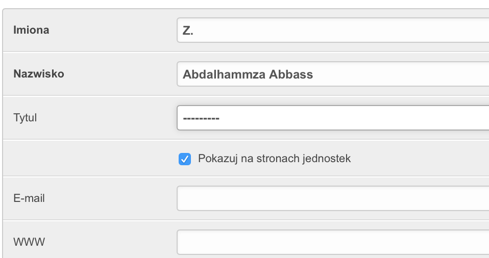
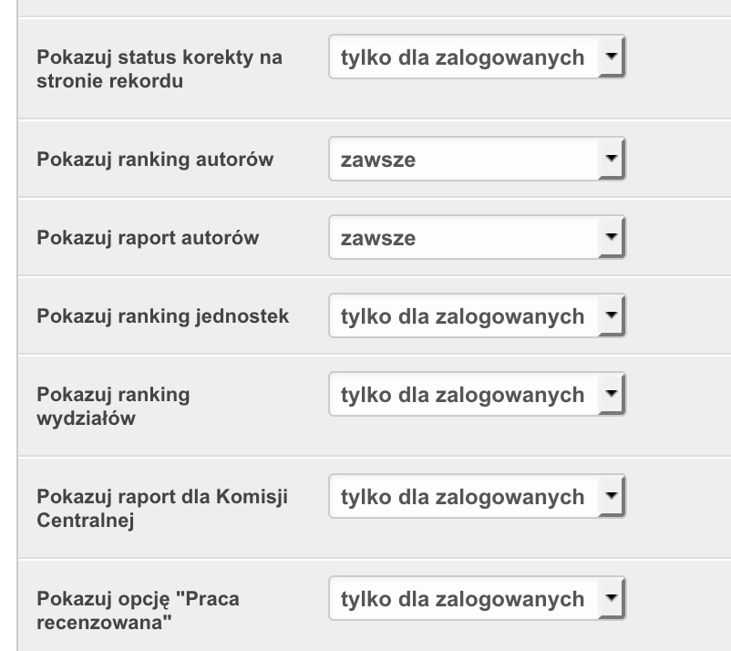
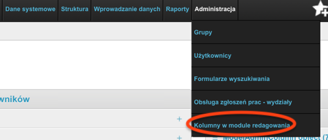
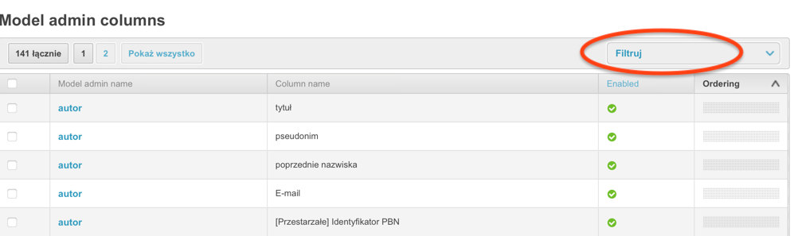
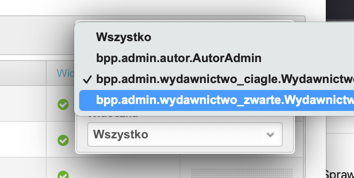
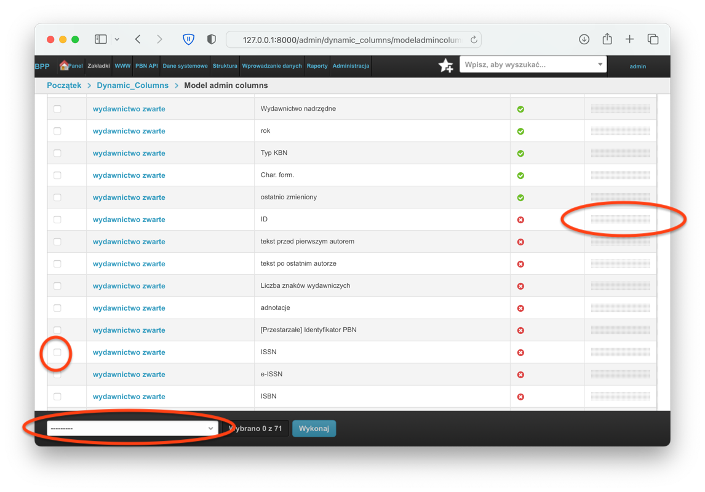
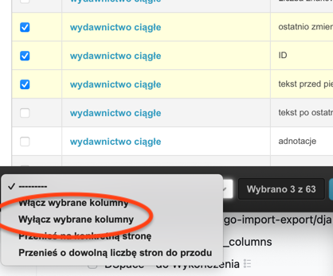

=============================
Instrukcja dla administratora
=============================

Konfiguracja sposobu prezentacji danych dla użytkowników niezalogowanych
------------------------------------------------------------------------

Ustawienia globalne - rekord uczelni
====================================

* po zainstalowaniu systemu, gdy baza danych jest pusta, potrzebujesz
  utworzyć obiekt "Uczelnia" za pomocą funkcji Redagowanie➡Struktura➡Uczelnia,

* za pomocą tejże opcji możesz ustawić logo uczelni oraz ikonę favicon (czyli
  zmniejszoną ikonę strony wyświetlającą się w pasku adresu przeglądarki oraz
  na urządzeniach przenośnych),

* za pomocą tej opcji ustawić możesz domyślą wartość pola "afiliuje" dla rekordów
  wiążących rekordy prac (wydawnictwo ciągłe, zwarte i patent) z autorami

Kolejnośc i zakres wyświetlanych wydziałów
~~~~~~~~~~~~~~~~~~~~~~~~~~~~~~~~~~~~~~~~~~

* aby ustalić kolejność i zakres wyświetlanych wydziałów uczelni, potrzebujesz
  przejrzeć obiekty "Wydział" znajdujące się poniżej formularza dla rekordu
  Uczelni. Skorzystaj z funkcji Redagowanie➡Struktura➡Uczelnie. Wydziały mogą
  być wyświetlane lub nie, możesz za pomocą tej funkcji ustawić je w określonej
  kolejności.

  .. note::

    wydziały w module interfejsu uzytkownika niezalogowanego nie są wyświelane
    alfabetycznie a zgodnie z ustaloną kolejnością.

* aby obejrzeć szczegóły wydziału skorzystaj z opcji
  Redagowanie➡Struktura➡Wydział

* pozostałe części serwisu dla użytkowników niezalogowanych wyświetlają
  dane w formacie kolumnowym, posortowane alfabetycznie.

Ukrywanie autorów na stronach jednostek
~~~~~~~~~~~~~~~~~~~~~~~~~~~~~~~~~~~~~~~~~~~

Aby ukryć informacje na temat autora na stronie jednostki, należy skorzystać
z opcji "Pokazuj na stronach jednostek". W przypadku doktorantów lub autorów
którzy nie są pracownikami danej jednostki należy je odznaczyć.

Po wybraniu dowolnego autora w module Redagowanie➡Wprowadzanie danych➡Autorzy
odznacz to pole i zapisz rekord, aby nie wyświetlać autora na stronie jednostki.

Ukrywanie lub wyświetlanie raportów na stronie głównej
~~~~~~~~~~~~~~~~~~~~~~~~~~~~~~~~~~~~~~~~~~~~~~~~~~~~~~

Celem konfiguracji sposobu wyświetlania strony głównej jak i innych elementów
serwisu, skorzystaj z opcji Redagowanie➡Struktura➡Uczelnie, a następnie w sekcji
"Strona wizualna" wyedytuj ustawienia dotyczące pokazywania różnych opcji
(rankingi, raporty, opcje rekordu). Niektóre ustawienia umożliwiają wyświetlanie
lub chowanie danego elementu, niektóre umożliwiają wyświetlenie danego elementu
tylko dla użytkowników zalogowanych.

Ukrywanie lub wyświetlanie formularzy wyszukiwania
~~~~~~~~~~~~~~~~~~~~~~~~~~~~~~~~~~~~~~~~~~~~~~~~~~

Gdy stworzysz formularz wyszukiwania w opcji Wyszukaj, możesz go zapisać. W ten
sposób formularz będzie dostępny w późniejszym czasie. Podczas zapisywania formularza
(opcja ta dostępna jest jedynie dla zalogowanych użytkowników) masz możliwość
określenia, czy chcesz, aby ten formularz widoczny był również dla innych
osób.

Jeżeli chcesz później schować lub pokazać takie formularze, skorzystaj z opcji
Redagowanie➡Administracja➡Formularze wyszukiwania. Kliknij nazwę takiego
formularza, następnie zaznacz lub odznacz opcję "Publiczny" i zapisz rekord

Sposób kalkulacji dyscyplin
---------------------------

1. Dyscyplina i subdyscyplina naukowa przypisana autorowi na dany rok zawiera się w rekordzie ``Autor_Dyscyplina``.

2. Dyscyplina naukowa którą autor deklaruje dla danej publikacji jest określana przez bibliotekarza
   każdorazowo dla powiązania autora do rekordu.

3. Zachowanie systemu podczas zmiany przypisań dyscyplin na dany rok opisuje niniejsza instrukcja
   w części :ref:`zachowanie-procedur`.

4. Od wersji oprogramowania ``1.0.30-dev3`` system nie domniemuje automatycznie dyscypliny
   dla danego przypisania autora do rekordu w przypadku braku takiej informacji. Innymi słowy,
   **pole "Dyscyplina" przy powiązaniu autora z rekordem musi być wypełnione**. Jeżeli jest puste,
   system nie bierze takiego autora pod uwagę przy kalkulacji dyscypliny. Zatem:

5. Dyscyplina dla danego autora przy przypisaniu do rekordu istniejącego musi być explicte wpisana.

6. Dyscyplina naukowa dla nowych rekordów: system podczas wpisywania nowego rekordu, po wybraniu
   imienia i nazwiska autora przy powiązaniu autora do rekordu będzie starał się podpowiedzieć dyscyplinę
   dla danego roku - w sytuacji, gdy autor ma wpisaną jedną.

7. W sytuacji gdy autor ma wpisane dwie dyscypliny dla danego roku, system nie podpowiada dyscypliny,
   pozostawiając to do decyzji bibliotekarza.

.. _zachowanie-procedur:

Zachowanie procedur utrzymujących integrację danych (triggerów) dla przypisań autora do dyscypliny
--------------------------------------------------------------------------------------------------

Założenia
=========

1. przypisanie autora do dyscypliny (rekord ``Autor_Dyscyplina``) na dany rok musi mieć główną dyscyplinę;

2. pole subdyscyplina może być puste,

3. procenty udziału dyscypliny i subdyscypliny, zsumowane, nie mogą przekroczyć 100%

Zachowanie
==========

1. **dopisanie dyscypliny** (utworzenie rekordu ``Autor_Dyscyplina``) na dany rok **nie powoduje** żadnych
   zmian w rekordach powiązanych; jeżeli autor miał jakieś przypisania do rekordów, pole "Dyscyplina"
   pozostaje w nich puste tzn ma nadal

   Rekordy te można będzie za pomocą zapytania bazodanowego przypisać do zadanych dyscyplin,
   jeżeli taka jest wola i decyzja redaktora / osób odpowiedzialnych za merytoryczną zawartość bazy
   danych.

2. **zmiana dyscypliny lub subdyscypliny** na **inną** powoduje zmianę dyscypliny przypisanej dla
   powiązań autor + rekord dla danego roku, dla danego autora - we wszystkich rekordach, które
   mają „starą” dyscyplinę lub subdyscyplinę - na nową

3. **zmiana subdyscypliny** na **pustą** powoduje zmianę dyscypliny przypisanej dla
   powiązań autor + rekord dla danego roku, dla danego autora - we wszystkich rekordach, które
   mają „starą” subdyscyplinę - na pustą.

4. **usunięcie przypisania** autora do dyscypliny (rekord ``Autor_Dyscyplina``)  powoduje ustawienie
    wartości pustej (``NULL``) dla danego roku, dla danego autora - we wszystkich rekordach, do
    których przypisany jest dany autor.

Pola "... ogólny" ("typ ogólny", "charakter ogólny" itp)
--------------------------------------------------------

W kilku miejscach systemu możemy natknąć się na pola nazwane w sposób
"... ogólny", "... dla eksportu", "... dla slotów" itp.

Przykładowo,
charakter formalny dla rekordów (Redagowanie➡Dane systemowe➡Charaktery formalne)
ma takie pola w chwili pisania tej dokumentacji:

* charakter PBN
* charakter dla slotów
* rodzaj dla PBN
* nazwa w PRIMO

Podobnie typ odpowiedzialności autora, czyli rekord określający czy osoba
przypisana do rekordu jest jego autorem czy np. redaktorem bądź tłumaczem
(Redagowanie➡Dane systemowe➡Typy odpowiedzialności) posiada:

* ogólny typ odpowiedzialności

Tego typu pola wydają się w pewnym sensie dublować informacje zawarte już w innych
polach rekordu.

Przykładowo typ odpowiedzialności "autor korespondencyjny" może mieć
pozornie zdublowaną informację "autor" jako typ ogólny. Podobnie, charakter formalny
"książka w języku polskim" może mieć pozornie zdublowaną informację "charkater dla slotów"
równe "książka".

Tego typu zapis danych jest jednak jak najbardziej celową i świadomą decyzją ze strony autorów
oprogramowania BPP.

Dzięki temu możemy sobie pozwolić na dowolnie zapisaną
nazwę danego charakteru formalnego bądź odpowiedzialności autora. W ten sposób
nie musimy np zmieniać informacji historycznej w systemie, bądź dokładać sobie
pracy w razie importu danych z zewnętrznych źródeł. Nazwa charakteru bądź typu odpowiedzialności
może byc w takim układzie dowolna.

System jednak potrzebuje wiedzieć dokładnie na potrzeby obliczeń, raportów i eksportu
danych, czy np. tekstowe określenie "autor korespondencyjny" czy "redaktor korespondencyjny wydania polskiego"
to autor, tłumacz czy redaktor - i właśnie dla takiego celu stworzone zostały pola
"... ogólne". Pola z charakterem "ogólnym" danego rekordu zawiera kilka rodzajów typów, odgórnie
zdefiniowanych w kodzie programu, które to potem w tym kodzie są wykorzystywane - na
potrzeby procedur liczących, raportujących, eksportujących dane itp.

Konfiguracja rodzaju i kolejności wyświetlanych kolumn w module redagowania
---------------------------------------------------------------------------

System umożliwia zmianę rodzaju i ilości wyświetlanych kolumn w module redagowania. W tym celu
użytkownik posiadający uprawnienia administratora po zalogowaniu się powinien w module redagowania
wejść w opcję Administracja -> Kolumny w module redagowania:

Następnie wyświetli się nam tabelka. W prawym górnym rogu, za pomocą opcji "Filtruj" wybieramy,
dla którego modułu chcemy skonfigurować kolumny. Klikamy na przycisk "Filtruj"

I wybieramy interesujący nas moduł:

Następnie możemy - za pomocą szarego prostokątu po prawej stronie - zmieniać kolejność kolumn.
Wystarczy najechac na niego myszą i przeciągnąć (ang. *drag and drop*):

Można też wybrane kolumny podświetlić za pomocą ptaszków (ang. *checkbox*) po lewej stronie i
na dole tabeli wybrać jedno z działań np włączyć lub wyłączyć grupowo wiele pól na raz.

.. note:: Niektóre kolumny w kodzie programu ustawione są jako *zawsze* *widoczne* i nie będą
    dostępne do edycji. Nie będzie można zmienić ich kolejności ani ich schować.

.. note:: Im więcej kolumn wybranych, tym więcej danych musi przetworzyć system. Im mniej
    - tym tabele będą wyświetlały się szybciej.
