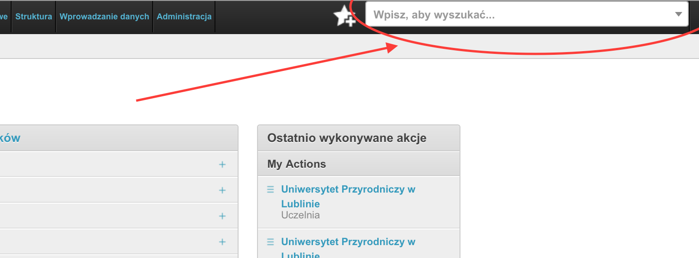
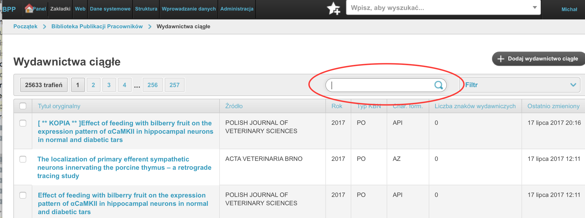

=============================
Instrukcja dla administratora
=============================

Konfiguracja sposobu prezentacji danych dla użytkowników niezalogowanych
------------------------------------------------------------------------

Ustawienia globalne - rekord uczelni
====================================

* po zainstalowaniu systemu, gdy baza danych jest pusta, potrzebujesz
  utworzyć obiekt "Uczelnia" za pomocą funkcji Redagowanie➡Struktura➡Uczelnia,

* za pomocą tejże opcji możesz ustawić logo uczelni oraz ikonę favicon (czyli
  zmniejszoną ikonę strony wyświetlającą się w pasku adresu przeglądarki oraz
  na urządzeniach przenośnych),

Kolejnośc i zakres wyświetlanych wydziałów
~~~~~~~~~~~~~~~~~~~~~~~~~~~~~~~~~~~~~~~~~~

* aby ustalić kolejność i zakres wyświetlanych wydziałów uczelni, potrzebujesz
  przejrzeć obiekty "Wydział" znajdujące się poniżej formularza dla rekordu
  Uczelni. Skorzystaj z funkcji Redagowanie➡Struktura➡Uczelnia. Wydziały mogą
  być wyświetlane lub nie, możesz za pomocą tej funkcji ustawić je w określonej
  kolejności.

  .. note::

    wydziały w module interfejsu uzytkownika niezalogowanego nie są wyświelane
    alfabetycznie a zgodnie z ustaloną kolejnością.

* aby obejrzeć szczegóły wydziału skorzystaj z opcji
  Redagowanie➡Struktura➡Wydział

* pozostałe części serwisu dla użytkowników niezalogowanych wyświetlają
  dane w formacie kolumnowym, posortowane alfabetycznie.

Ukrywanie autorów na stronach jednostek
~~~~~~~~~~~~~~~~~~~~~~~~~~~~~~~~~~~~~~~~~~~

Aby ukryć informacje na temat autora na stronie jednostki, należy skorzystać
z opcji "Pokazuj na stronach jednostek". W przypadku doktorantów lub autorów
którzy nie są pracownikami danej jednostki należy je odznaczyć.

Po wybraniu dowolnego autora w module Redagowanie➡Wprowadzanie danych➡Autorzy
odznacz to pole i zapisz rekord, aby nie wyświetlać autora na stronie jednostki.

Wyszukiwanie i filtrowanie rekordów w module Redagowanie
--------------------------------------------------------

Wyszukiwanie globalne
~~~~~~~~~~~~~~~~~~~~~~~~

Cały moduł Redagowanie, podobnie jak i moduł dla użytkowników niezalogowanych
wyposażony jest w globalne wyszukiwanie. Na górze ekranu znajduje się pole
tekstowe, w które możemy wpisać część tytułu rekordu aby przeszukać jednocześnie
wydawnictwa ciągłe, zwarte, patenty, habilitacje, doktoraty, autorów, jednostki
i źródła. W ten sposób wygodnie można przejść do pożądanego rekordu.

Po wpisaniu ciągu znaków otrzymujemy rozwijaną listę z rekordami różnego rodzaju:

.. image:: images/admin/wyszukiwanie_globalne_2.png

.. note::

  Do tego pola możemy wprowadzić numer ID rekordu aby znaleźć rekord o tym ID.

Filtrowanie konkretnych tabel
~~~~~~~~~~~~~~~~~~~~~~~~~~~~~~

Większość tabel w module Redagowanie wyposażona jest w okno filtru tekstowego.
Możemy tam wpisać dowolny ciąg znaków (włącznie z numerem ID), w ten sposób
powodując, ze system wyszuka prace zawierające ten ciąg znaków. Zazwyczaj
przeszukiwane jest pole "tytuł oryginalny", "źródło", "informacje", "szczegóły",
"adnotacje", "rok" ale dla specyficznych tabel mogą być to również inne pola.

Filtrowanie precyzyjne pozwala nam wybrać prace w bardziej szczegółowy sposób,
na podstawie konkretnych pól. Przykładowo, na poniższym rysunku przedstawione są
dostępne filtry dla tabeli "Wydawnictwo ciągłe".

.. image:: images/admin/filtry.png

Na poniższym rysunku z kolei przedstawione są przykładowe opcje dla pola "Język". 

.. image:: images/admin/filtry_jezyk.png
