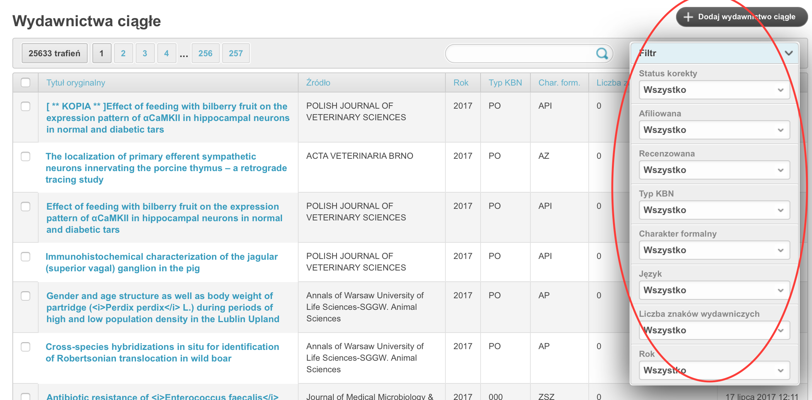
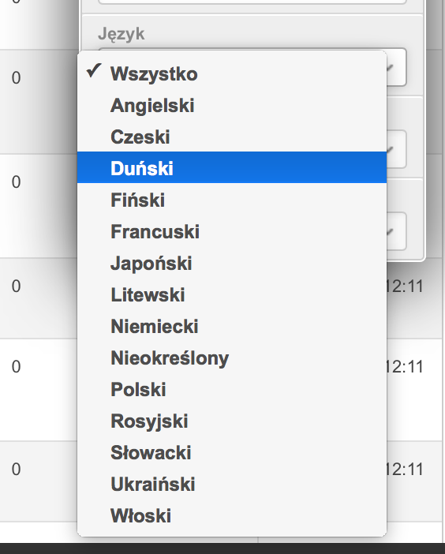

======================
Instrukcja redaktora
======================

Dodawanie i edycja rekordów
---------------------------

Dodawanie autorów do rekordów
~~~~~~~~~~~~~~~~~~~~~~~~~~~~~

Aby dodać autora do rekordu, podczas dodawania lub edycji nowego rekordu kliknij
"Dodaj kolejne powiązanie autora z wyd. ciągłym / wyd. zwartym / patentem ...".

Zmiana kolejności autorów
~~~~~~~~~~~~~~~~~~~~~~~~~

Aby zmienić kolejność autorów, skorzystaj z przycisku przeciągania oraz techniki
"przeciągnij i upuść". Po prostu kliknij i przytrzymaj lewym przyciskiem myszy na
przycisku przeciągania i przeciągnij dane powiązanie autora z rekordem w górę
lub w dół. Przycisk przeciągania wygląda w następujący sposób:

.. image:: images/editor/przycisk_przeciagania.png
   :alt: Przycisk przeciągania

Działania te również prezentuje film "Zmiana kolejności autorów"_ : 

.. raw:

  <iframe width="560" height="315" src="https://www.youtube.com/embed/oruEX3CykH8" frameborder="0" allow="autoplay; encrypted-media" allowfullscreen></iframe>

.. _film "Zmiana kolejności autorów": https://www.youtube.com/embed/oruEX3CykH8

Wyszukiwanie i filtrowanie rekordów w module Redagowanie
--------------------------------------------------------

Wyszukiwanie globalne
~~~~~~~~~~~~~~~~~~~~~~~~

Cały moduł Redagowanie, podobnie jak i moduł dla użytkowników niezalogowanych
wyposażony jest w globalne wyszukiwanie. Na górze ekranu znajduje się pole
tekstowe, w które możemy wpisać część tytułu rekordu aby przeszukać jednocześnie
wydawnictwa ciągłe, zwarte, patenty, habilitacje, doktoraty, autorów, jednostki
i źródła. W ten sposób wygodnie można przejść do pożądanego rekordu.

.. image:: images/admin/wyszukiwanie_globalne.png

Po wpisaniu ciągu znaków otrzymujemy rozwijaną listę z rekordami różnego rodzaju:

.. image:: images/admin/wyszukiwanie_globalne_2.png

.. note::

  Do tego pola możemy wprowadzić numer ID rekordu aby znaleźć rekord o tym ID.

Filtrowanie konkretnych tabel
~~~~~~~~~~~~~~~~~~~~~~~~~~~~~~

Większość tabel w module Redagowanie wyposażona jest w okno filtru tekstowego.
Możemy tam wpisać dowolny ciąg znaków (włącznie z numerem ID), w ten sposób
powodując, ze system wyszuka prace zawierające ten ciąg znaków. Zazwyczaj
przeszukiwane jest pole "tytuł oryginalny", "źródło", "informacje", "szczegóły",
"adnotacje", "rok" ale dla specyficznych tabel mogą być to również inne pola.

.. image:: images/admin/wyszukiwanie.png

Filtrowanie precyzyjne pozwala nam wybrać prace w bardziej szczegółowy sposób,
na podstawie konkretnych pól. Przykładowo, na poniższym rysunku przedstawione są
dostępne filtry dla tabeli "Wydawnictwo ciągłe".

Na poniższym rysunku z kolei przedstawione są przykładowe opcje dla pola "Język".

