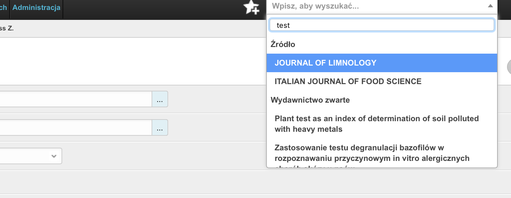

Wyszukiwanie i filtrowanie rekordów w module Redagowanie
--------------------------------------------------------

Wyszukiwanie globalne
~~~~~~~~~~~~~~~~~~~~~~~~

Cały moduł Redagowanie, podobnie jak i moduł dla użytkowników niezalogowanych
wyposażony jest w globalne wyszukiwanie. Na górze ekranu znajduje się pole
tekstowe, w które możemy wpisać część tytułu rekordu aby przeszukać jednocześnie
wydawnictwa ciągłe, zwarte, patenty, habilitacje, doktoraty, autorów, jednostki
i źródła. W ten sposób wygodnie można przejść do pożądanego rekordu.

.. image:: images/admin/wyszukiwanie_globalne.png

Po wpisaniu ciągu znaków otrzymujemy rozwijaną listę z rekordami różnego rodzaju:

.. note::

  Do tego pola możemy wprowadzić numer ID rekordu aby znaleźć rekord o tym ID.

Filtrowanie konkretnych tabel
~~~~~~~~~~~~~~~~~~~~~~~~~~~~~~

Filtr tekstowy
++++++++++++++

Większość tabel w module Redagowanie wyposażona jest w okno filtru tekstowego.
Możemy tam wpisać dowolny ciąg znaków (włącznie z numerem ID), w ten sposób
powodując, ze system wyszuka prace zawierające ten ciąg znaków. Zazwyczaj
przeszukiwane jest pole "tytuł oryginalny", "źródło", "informacje", "szczegóły",
"adnotacje", "rok" ale dla specyficznych tabel mogą być to również inne pola.

.. image:: images/admin/wyszukiwanie.png

Filtr precyzyjny
++++++++++++++++

Filtrowanie precyzyjne pozwala nam wybrać prace w bardziej szczegółowy sposób,
na podstawie konkretnych pól. Przykładowo, na poniższym rysunku przedstawione są
dostępne filtry dla tabeli "Wydawnictwo ciągłe".

.. image:: images/admin/filtry.png

Na poniższym rysunku z kolei przedstawione są przykładowe opcje dla pola "Język".

.. image:: images/admin/filtry_jezyk.png
    :width: 30%

Filtrowanie przy pomocy języka zapytań
++++++++++++++++++++++++++++++++++++++

Część tabel w module Redagowanie umożliwia wyszukiwanie rekordów przy pomocy języka
zapytań `DjangoQL`_ . Można poznać to po tym, że w polu filtru tekstowego będzie widniała,
domyślnie wyłączona, kontrolka typu "checkbox" - jak na zrzucie ekranu ponizej:

Kontrolka pusta - wyłaczona, oznacza, że filtrowanie DjangoQL jest wyłączone; wyszukiwanie za
pomocą tekstu będzie wyglądało tak, jak opisane w sekcji `Filtr tekstowy`_.

Po włączeniu kontrolki będziemy mieli możliwość wpisania nie tekstu do wyszukania, ale
zapytania w języku `DjangoQL`_ . Przykładowo, dla tabeli wydawnictw ciągłych chcielibyśmy
wyszukać rekordy opublikowane w roku 2010 lub 2020 powinniśmy wpisać:

.. code-block:: python

  rok = 2010 or rok = 2020

Wybór rzecz jasna zatwierdzamy klawiszem ENTER lub klikając w lupę. W rezultacie otrzymujemy wynik wyszukiwania:

.. note :: Język zapytań DjangoQL działa w kontekście danej tabeli. Oznacza to, że zapytanie ``rok = 2020`` da zupełnie
  poprawne wyniki w kontekście tabeli wydawnictw ciągłych lub zwartych, zaś uruchomione w tabeli źródeł zwróci błąd.
  Będzie tak dlatego, że źródła w swoim opisie nie posiadają pola ``rok``. Przykłady w tym rozdziale operaują na tabelach
  wydawnictw.

Spróbujmy czegoś trudniejszego. Wyszukajmy prace, których impact factor jest większy od 2 i charakter
formalny to artykuł lub ksiażka. Redaktor na pewno zauważy, że podczas pisania tekstu przy włączonym wyszukiwaniu
`DjangoQL`_ system próbuje podpowiadać nazwy kolumn:

Po wpisaniu kilku znaków więcej i naciśnięciu kropki otrzymujemy podopowiedzi wszystkich pól obiektu
"Charakter formalny", które możemy przeszukac:

.. note :: Część nazw pól może być oczywista już na pierwszy rzut oka, jak na przykład ``charakter_formalny.nazwa`` czy
  ``charakter_formalny.skrot``. Pozostałe mogą nie być tak oczywiste, ale nie przejmujemy się tym -
  część pól może mieć znaczenie dla systemu i ich przeszukiwanie przez użytkownika nie będzie mu w żaden
  sposób przydatne. Przykładem mogą być widoczne na zrzucie ekranu pola nazwane ``lft``, ``rght``, ``parent``,
  ``level``, które odpowiadają za drzewiastą strukturę tabeli charakterów formalnych i ich interpretacją
  zajmują się odpowiednie procedury po stronie oprogramowania i bazy danych.

Dokończmy nasze zapytanie:

.. code-block:: python

  (charakter_formalny.skrot = "KSP" or charakter_formalny.skrot = "AC") and impact_factor > 2

Jak widać na zrzucie ekranu poniżej, zadziałało ono:

Jeżeli wpiszemy zapytanie niepoprawnie, nic się nie stanie. System nie wykona takiego zapytania,
informując nas o błedzie składniowym. Przykładowo gdy zamiast operatora ``or`` użyjemy polskiego
słowa ``lub``, system poinformuje nas o tym w taki sposób:

Przykładowe zapytania w DjangoQL
++++++++++++++++++++++++++++++++

Rekordy z dyscyplinami
""""""""""""""""""""""

Załózmy, że chcemy odfiltrować wszystkie rekordy z uzupełnionymi dyscyplinami -- rekordy, gdzie przynajmniej
jedna dyscyplina jest uzupełniona.

Z uwagi na sposób w jaki budowane
są zapytania po stronie bazy danych i z uwagi na strukturę danych, zapytanie takie jak poniżej nie da pożądanych
efektów:

.. code-block:: python

  autorzy_set.dyscyplina_naukowa != None

To zapytanie znajdzie rekordy, gdzie **wszystkie** dyscypliny są wypełnione - czyli, że każdy podpięty do
rekordu autor ma określoną dyscyplinę; jeżeli przynajmniej jeden autor nie ma dyscypliny, to nie pojawi się
na liście wyników.

Aby wyszukać rekordy z dyscyplinami, gdzie przynajmniej jeden autor ma dyscyplinę, zapytanie można sformułować w taki sposób:

.. code-block:: python

  autorzy_set.dyscyplina_naukowa.nazwa ~ "a"
  or autorzy_set.dyscyplina_naukowa.nazwa ~ "i"

W ten sposób szukamy prac z dyscypliną naukową zawierającą w nazwie literkę “A” (czyli wszystkie oprócz “rolnictwo i ogrodnictwo”) oraz literkę “I”.

Rekordy w źródłach bez odpowiedników w PBN
""""""""""""""""""""""""""""""""""""""""""

Aby znaleźć wszystkie wydawnictwa ciągłe, gdzie wpisana jest jakas dyscyplina, a **ich źródło** nie ma odpowiednika PBN,
a rok jest większy lub równy jak 2017, należy dla wydawnictw wpisać taki kod DjangoQL:

.. code-block:: python

  (autorzy_set.dyscyplina_naukowa.nazwa ~ "a"  or autorzy_set.dyscyplina_naukowa.nazwa ~ "i")
  and rok >= 2017
  and zrodlo.pbn_uid = None

Autorzy ukryci, z aktualnym miejscem pracy określonym, innymi niż 'Obca jednostka'
"""""""""""""""""""""""""""""""""""""""""""""""""""""""""""""""""""""""

Aby znaleźć autorów z atrybutem "pokazuj" ustalonym na "nie", z aktualnym miejscem
pracy nie-pustym, ale innym, niż "Obca jednostka", w tabeli autorów wpisujemy następujące
zapytanie DjangoQL:

.. code-block:: python

 pokazuj = False and aktualna_jednostka.nazwa != "Obca jednostka"
 and aktualna_jednostka != None

Operatory logiczne a ich kolejność
""""""""""""""""""""""""""""""""""

Operatory logiczne ``and`` (czyli po polsku ``i``) oraz operator logiczny ``or`` (czyli po polsku ``lub``)
zachowują się podobnie jak mnożenie i dodawanie. Odpowiednikiem mnożenia jest operator ``and``, zaś odpowiednikiem
dodawania jest operator ``lub``. Oznacza to, że ciąg zapytań ``and`` jest traktowany jak jedna całość:

.. code-block:: python

  rok = 2020 and charakter_formalny.skrot = "KSP" and impact_factor > 2

To zapytanie wyszuka prace z 2020 roku, z charakterem formalnym "KSP" czyli "książka polska" i z impact
factorem większym od 2.

Dołożenie operatora ``or`` do takiego ciągu zapytań może nie dać dobrych efektów:

.. code-block:: python

  rok = 2020 or rok = 2021 and charakter_formalny.skrot = "KSP" and impact_factor > 2

Takie zapytanie znajdzie **wszystkie** rekordy z 2020 roku oraz prace z 2021 roku, z charakterem formalnym
"KSP" czyli "książka polska" i z impact factorem większym od 2. Rekordy z 2020 roku wygenerują się
wszystkie, ponieważ operator ``or`` działa jak dodawanie. Porównajmy pierwsze zapytanie:

.. code-block:: python

  10 * 20 * 30     # <-- tak możemy przedstawić pierwsze przykładowe zapytanie
  # wynik to 6000

... a tak drugie:

.. code-block:: python

  10 + 20 * 30 * 40 # <-- tak możemy przedsatwić drugie przykładowe zapytanie
  # wynik działań to nie 36000, a 24010...

Na pierwszy rzut oka widać, co trzeba zrobić -- dodać nawiasy:

.. code-block:: python

  (rok = 2020 or rok = 2021) and charakter_formalny.skrot = "KSP" and impact_factor > 2

Analogicznie w przykładzie matematycznym:

.. code-block:: python

  (10 + 20) * 30 * 40 # wynik to 36000

.. note :: Podobnie jak w matematyce mnożenie przed dodawaniem -- operator logiczny
  ``and`` ma pierwszeństwo przed operatorem logicznym ``or``. Po więcej informacji zapraszamy
  na `Wikipedię`_

.. _DjangoQL: https://github.com/ivelum/djangoql#language-reference
.. _Wikipedię: https://pl.wikipedia.org/wiki/Operator_logiczny
