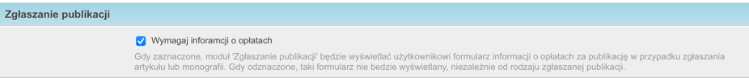

Zgłaszanie publikacji
---------------------

Proces
======

.. note:: Jednym z założeń systemu BPP jest najwyższa jakość danych przechowywanych w bazie. Pracownicy
    naukowi instytucji mogą zgłaszać swoje publikacje, jednak nie jest to proces jednoznaczny z dopisaniem
    pracy do bazy. Zgłoszenia publikacji mogą być przeglądane i weryfikowane przez bibliotekarzy i w następnej
    kolejności mogą do bazy zostać dopisane. Bez założenia loginu i przypisania uprawnień pracownik naukowy
    nie jest w stanie dopisywać żadnych rekordów do bazy.

Moduł "zgłoś publikację" umożliwia zgłaszanie publikacji użytkownikom nie mającym loginu do systemu, np
pracownikom naukowym uczelni.

Po kliknięciu w link użytkownik otrzymuje formularz:

W zależności od wybranych przez użytkownika opcji, formularz ma różną ilość kroków.

W pierwszym kroku wypełniamy dane ogólne - tytuł, rodzaj zgłaszanej publikacji, rok, e-mail zgłaszającego
oraz czy publikacja jest dostępna w sieci pod jakimś adresem.

Jeżeli pole "Dostępna w sieci pod adresem" jest puste, w następnym kroku zostanie wyświetlona prośba o
wysłanie załącznika PDF z pełnym tekstem zgłaszanej publikacji.

Następnie system zapyta o autorów publikacji. Można wpisywać autorów wraz z dyscyplinami - jest to szczególnie
ważne dla autorów wielodyscyplinowych. Można też nic nie wpisywać:

Jeżeli "rodzaj zgłaszanej publikacji" to "artykuł naukowy lub monografia", w ostatnim kroku zostanie wyświetlony
do uzupełnienia formularz opłat za publikację, chyba, ze skonfigurowano inaczej.

Po pomyślnym zakończeniu zgłaszania publikacji użytkownik zobaczy informację z podziękowaniem:

Powiadamianie redaktorów
========================

W ostatnim kroku system informował nas o powiadomieniu redaktorów systemu o nowym zgłoszeniu. Kto otrzymuje
takie powiadomienia?

Domyślnie otrzymają takie powiadomienie wszystkie osoby, które są w grupie "wprowadzanie danych".

Jeżeli jednak mamy użytkowników w systemie dopisanych do grupy "wprowadzanie danych", wówczas tylko tacy
użytkownicy otrzymają powiadomienia o nowych zgłoszeniach. Możemy ich do niej dopisać, korzystając z opcji
Redagowanie -> Administracja -> Użytkownicy.

Możemy też rozdzielać powiadomienia wg wydziałów uczelni. Za pomocą opcji Redagowanie -> Administracja ->  Obsługa zgłoszeń
prac - wydziały możemy dopisać konkretnych użytkowników do konkretnych wydziałów. W sytuacji, gdy zgłaszający
publikację wypełni przynajmniej jednego autora i jego jednostkę, powiadomienie o tym zgłoszeniu trafi do
przypisanej osoby - według wydziału pierwszej, skupiającej pracowników jednostki autora, wg kolejności autorów
w zgłoszeniu.

Czyli, jeżeli pierwszych kilku autorów ma przypisaną "Obcą jednostkę", a kolejny ma przypisaną jednostkę
należącą do wydziału X, to powiadamiane będą osoby przypisane do wydziału X.

Nic nie stoi na przeszkodzie, aby przypisać też osoby powiadamiane w przypadku dodania pracy
do obcej jednostki (przydzielając jej wirtualny wydział np "obcy wydział") - w tej sytuacji
powiadomienia będą mogły otrzymać osoby gdy np praca nie ma żadnego autora z uczelni.

Zwracanie zgłoszenia
====================

W przypadku, gdyby zgłoszenie wymagało poprawek, po wejściu w nie w module redagowania (Redagowanie -> Wprowadzanie danych
-> Zgłoszenia publikacji -> tytuł zgłoszenia) szukamy przycisku "Zwróć do autora", który znajduje się na belce nad
formularzem. Po kliknięciu możemy wpisać powód zwrócenia zgłoszenia. Autor otrzyma e-mail z powodem zwrócenia
zgłoszenia oraz z linkiem do edycji zgłoszenia. Gdy je zatwierdzi, redaktor otrzyma powiadomienie wg reguł jak wyżej.

Wymaganie zalogowania
=====================

Moduł może zostać skonfigurowany tak, aby wymagać zalogowania się przez użytkownika. W ten sposób, przy jednoczesnej
włączonej integracji z :ref:`LDAP (ActiveDirectory) <Konfiguracja LDAP (ActiveDirectory)>` możemy wymagać od użytkowników zalogowania się na swoje konto w sieci
intranet -- nie trzeba każdemu zakładać loginu i hasła.

W tym celu należy wejsć w :ref:`edycję danych uczelni <Edycja danych uczelni>` i zaznaczyć "Pokazuj opcję 'Zgłoś nową publikację'" jako
"tylko dla zalogowanych".

Jeżeli chcemy umożliwić dodawanie zgłoszeń publikacji osobom niezalogowanym należy powyższą opcję ustawić jako "zawsze".

Jeżeli chcemy w ogóle wyłączyć możliwość dodawania zgłoszeń publikacji, należy wybrać tam "nigdy".

Wymaganie wpisania informacji o opłatach za publikację
======================================================

W przypadku, gdy użytkownik w pierwszym formularzu przy zgłaszaniu publikacji wybierze "artykuł lub monografia",
domyślnie zostanie zapytany w ostatnim formularzu o opłaty.

Możemy wyłaczyć tą opcję i nie pytać o opłaty. W tym celu należy wejsć w :ref:`edycję danych uczelni <Edycja danych uczelni>`
i odnaleźc zakładkę "Zgłaszanie publikacji":

