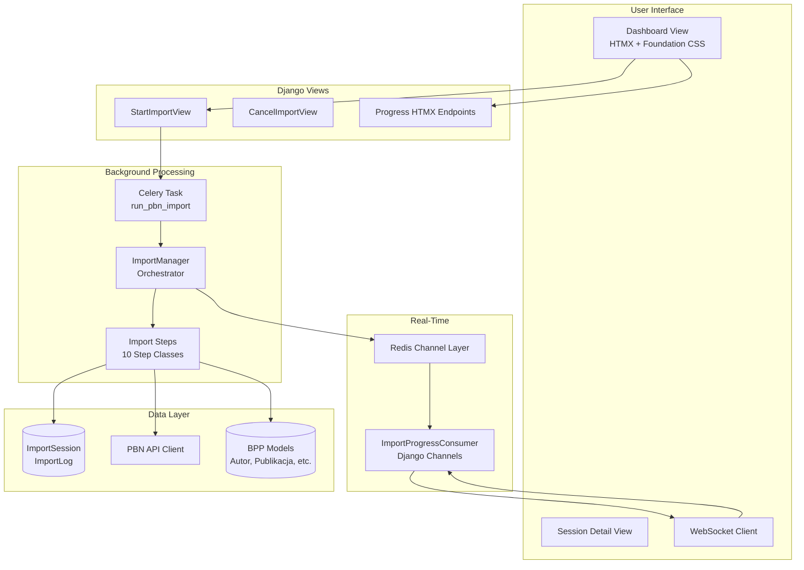
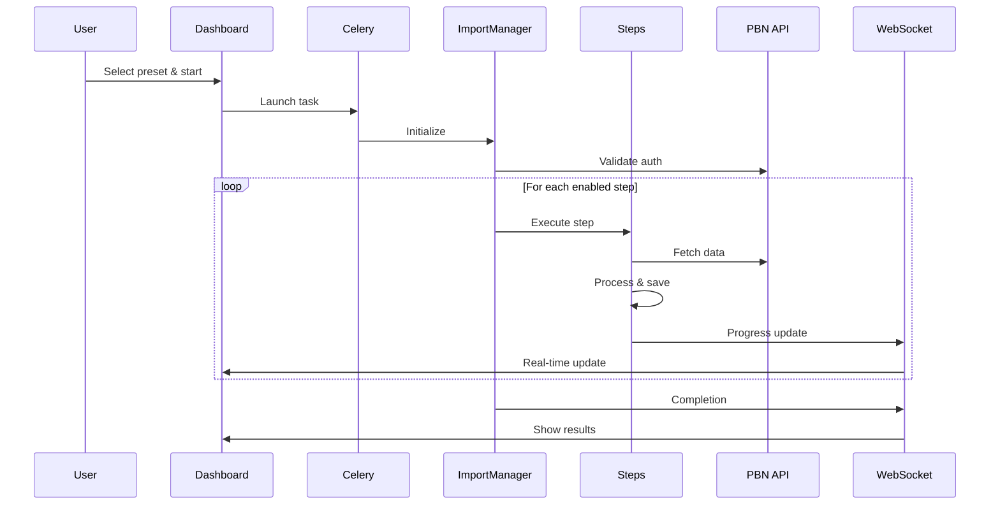

# PBN Import Application - Architecture Documentation

> Auto-generated by Cartographer. Last mapped: 2026-01-16

## Overview

The `pbn_import` app is a sophisticated data import system for synchronizing bibliographic data from Poland's PBN (Polish Bibliography Network) into the BPP system. It features real-time progress tracking via WebSockets, comprehensive error handling, and a modern HTMX-powered UI.

**Files**: 58 | **Tokens**: ~70k

## Architecture Diagram



## Data Models

### ImportSession

Tracks individual import sessions with progress and status.

| Field | Type | Description |
|-------|------|-------------|
| `user` | ForeignKey | Who started the import |
| `status` | CharField | pending/running/completed/failed/cancelled |
| `task_id` | CharField | Celery task ID for cancellation |
| `current_step` | CharField | Current step name |
| `current_step_progress` | IntegerField | 0-100% for current step |
| `total_steps` / `completed_steps` | IntegerField | Step counters |
| `progress_data` | JSONField | Detailed subtask progress |
| `config` | JSONField | Import configuration |
| `error_message` / `error_traceback` | TextField | Error details |

**Key Methods**:
- `mark_completed()` - Mark session as successfully completed
- `mark_failed(error_message, traceback)` - Mark session as failed with error details
- `update_progress(step_name, progress_percent, step_number)` - Update current progress
- `overall_progress` (property) - Calculate overall completion percentage
- `duration` (property) - Calculate session duration

### ImportLog

Detailed log entries for each session.

| Field | Type | Description |
|-------|------|-------------|
| `session` | ForeignKey | Parent session |
| `level` | CharField | debug/info/warning/error/success/critical |
| `step` | CharField | Which step generated this log |
| `message` | TextField | Log message |
| `details` | JSONField | Additional structured data |

**Indexes**: `(session, -timestamp)`, `(level)`

### ImportStep

Defines import steps and their configuration.

| Field | Type | Description |
|-------|------|-------------|
| `name` | CharField | Unique step identifier |
| `display_name` | CharField | Human-readable name |
| `description` | TextField | Step description |
| `order` | IntegerField | Execution order |
| `is_optional` | BooleanField | Can be skipped |
| `estimated_duration` | IntegerField | Seconds |
| `icon_class` | CharField | Foundation Icons class |

---

## Import Step Pipeline



### Available Steps (in order)

| # | Step Name | Class | Required | Purpose |
|---|-----------|-------|----------|---------|
| 1 | `initial_setup` | InitialSetup | Yes | Languages, countries, disciplines, institutions |
| 2 | `institution_setup` | InstitutionImporter | Yes | Default departments/units |
| 3 | `source_import` | SourceImporter | No | Journals from MNiSW |
| 4 | `publisher_import` | PublisherImporter | No | Publisher data |
| 5 | `conference_import` | ConferenceImporter | No | Conference data |
| 6 | `author_import` | AuthorImporter | No | Authors from institution |
| 7 | `publication_import` | PublicationImporter | No | Publications (v1 + v2 API) |
| 8 | `statement_import` | StatementImporter | No | Author statements |
| 9 | `fee_import` | FeeImporter | No | Publication fees |

> **Note**: The `data_integration` step was removed as redundant. Publications are created
> with `pbn_uid_id` already set during import, and statement integration is handled by
> `statement_import`.

### Step Configuration

Steps can be disabled via config keys:

```python
config = {
    'disable_initial': False,      # Keep initial setup
    'disable_zrodla': True,        # Skip source import
    'disable_autorzy': False,      # Keep author import
    'disable_publikacje': False,   # Keep publication import
    'delete_existing': False,      # Don't delete existing data
    'wydzial_domyslny': 'Wydział Domyślny',
}
```

---

## Key Components

### ImportManager (`utils/import_manager.py`)

**Purpose**: Orchestrates the entire import process.

**Responsibilities**:
- Validates PBN authorization before starting
- Executes steps sequentially based on configuration
- Handles cancellation checks between steps
- Runs post-import commands on success
- Broadcasts progress via WebSocket

**Post-import commands**:
- `ustaw_zwrotnie_punkty_zwartych`
- `ustaw_zwrotnie_punkty_ciaglych`
- `przypisz_rekordy_aktualnym_jednostkom_autorow`
- `denorm_flush`

### ImportStepBase (`utils/base.py`)

**Purpose**: Base class for all import steps.

```python
class ImportStepBase:
    step_name: str = "Unknown Step"
    step_description: str = "Przetwarzanie..."

    def __init__(self, session, client=None):
        self.session = session
        self.client = client  # PBN API client

    # Logging
    def log(level, message, details=None)

    # Progress tracking
    def update_progress(current, total, message="")
    def create_subtask_progress(subtask_name) -> TqdmSessionProgress

    # Lifecycle (called by __call__)
    def start()   # Log begin
    def run()     # Override - main logic
    def finish()  # Log completion

    # Cancellation
    def check_cancelled() -> bool
    def raise_if_cancelled()

    # Error handling
    def handle_error(error, context="")
    def handle_pbn_error(error, context="")  # Raises if 403
```

### WebSocket Consumer (`consumers.py`)

**Purpose**: Real-time progress updates via Django Channels.

**Message Types**:

| Type | Direction | Description |
|------|-----------|-------------|
| `connection` | Server→Client | Connection confirmation |
| `progress_update` | Server→Client | Step progress changes |
| `log_entry` | Server→Client | New log entries |
| `status_change` | Server→Client | Session status changes |
| `completion` | Server→Client | Import finished |
| `ping` | Client→Server | Keep-alive |
| `request_status` | Client→Server | Request current status |
| `request_logs` | Client→Server | Request recent logs |

**Connection URL**: `ws://host/ws/pbn-import/session/{session_id}/`

### Celery Task (`tasks.py`)

```python
@shared_task(bind=True)
def run_pbn_import(self, session_id):
    session = ImportSession.objects.get(pk=session_id)
    session.status = 'running'
    session.task_id = self.request.id
    session.save()

    uczelnia = Uczelnia.objects.first()
    client = uczelnia.pbn_client() if uczelnia else None

    manager = ImportManager(session, client, session.config)
    manager.run()

    # Update status based on results
    # Send WebSocket completion notification
```

---

## Progress Tracking

### Multi-Level Progress System

```
Session Progress (overall)
├── Step Progress (per step)
│   ├── Subtask Progress (e.g., "Downloading authors")
│   │   ├── Current: 45
│   │   ├── Total: 100
│   │   └── Percentage: 45%
│   └── Step Percentage: 0-100%
└── Overall: (completed_steps/total_steps * 100) + (current_step_progress/total_steps)
```

### Progress Data Structure

Stored in `ImportSession.progress_data` (JSONField):

```json
{
  "steps": {
    "author_import": {
      "processed": 45,
      "total": 100,
      "progress": 45,
      "message": "Importing authors",
      "errors": 0
    }
  },
  "current_subtask": {
    "name": "Pobieranie autorów",
    "description": "Processing batch 3/10",
    "current": 30,
    "total": 100,
    "percentage": 30
  }
}
```

### TqdmSessionProgress

Custom progress reporter that updates session database:

```python
callback = self.create_subtask_progress("Downloading authors")
for item in pbar(items, callback=callback):
    process(item)
callback.clear()
```

---

## Error Handling

### Error Hierarchy

| Error Type | Behavior |
|------------|----------|
| Authorization (403) | **Critical** - stops import immediately |
| Required step failure | **Critical** - marks import as failed |
| Optional step failure | **Warning** - logs error and continues |
| Cancellation | **Graceful** - checked every 10 items in loops |

### Error Handling Pattern

```python
try:
    risky_operation()
except AuthorizationError as e:
    self.handle_pbn_error(e, "Context")  # Raises if 403
except OtherError as e:
    self.handle_error(e, "Context")  # Logs and continues
```

### Error Reporting

All errors are:
- Logged to `ImportLog` with full details
- Reported to Rollbar with session context
- Displayed in UI with appropriate severity
- Tracebacks visible only to superusers

---

## UI/UX Flow

### Dashboard (`/pbn-import/`)

1. **Active Import Card** (if running)
   - Real-time progress bar
   - Current step display
   - Cancel button
   - Auto-updates via HTMX every 5 seconds

2. **Import Presets** (if no active import)
   - **Full Import**: All steps enabled
   - **Update Import**: Skip initial setup and sources
   - **Integration Only**: Only integrate existing data

3. **Session History**
   - Last 10 sessions
   - Status badges (color-coded)
   - Click to view full session detail

### Session Detail (`/pbn-import/session/{id}/`)

**Sections**:
- Progress bar (live via HTMX)
- Error display with collapsible traceback (superusers only)
- Tabbed content:
  - **Logs**: All log entries with level badges
  - **Errors**: Filtered to warnings/errors/critical
  - **Configuration**: Import settings table
  - **Statistics**: Counts, API performance, coffee breaks

---

## Management Commands

### pbn_import

CLI interface for running imports:

```bash
uv run python src/manage.py pbn_import \
  --app-id ABC123 \
  --app-token xyz789 \
  --user-token user456 \
  --disable-konferencje \
  --wydzial-domyslny "Wydział Informatyki"
```

**Arguments**:
- `--app-id`, `--app-token`, `--user-token` - PBN credentials (required)
- `--base-url` - API URL (default: https://pbn-micro-alpha.opi.org.pl)
- `--disable-*` - Disable specific steps
- `--delete-existing` - Delete existing PBN publications
- `--wydzial-domyslny` - Default department name

### test_pbn_import

Test import with mock data (development only).

---

## Integration Points

| App | Integration |
|-----|-------------|
| `bpp` | Target models (Autor, Wydawnictwo_*, Jednostka, Uczelnia) |
| `pbn_api` | API client, Publication/Statement/Journal models |
| `pbn_integrator` | Integration functions (integruj_autorow, integruj_publikacje) |
| `import_common` | Utility functions (matchuj_uczelnie) |
| Django Channels | WebSocket real-time updates |
| Celery | Background task processing |

---

## File Reference

| File | Purpose | Tokens |
|------|---------|--------|
| `models.py` | Data models | 1,673 |
| `views.py` | Dashboard, session views, HTMX endpoints | 2,795 |
| `admin.py` | Admin interface | 2,070 |
| `urls.py` | URL routing | 263 |
| `tasks.py` | Celery tasks | 1,009 |
| `consumers.py` | WebSocket consumer | 1,212 |
| `routing.py` | WebSocket routing | 59 |
| `utils/import_manager.py` | Main orchestrator | 2,716 |
| `utils/base.py` | ImportStepBase class | 2,005 |
| `utils/step_definitions.py` | Step configuration | 937 |
| `utils/initial_setup.py` | Initial setup step | 2,096 |
| `utils/institution_import.py` | Institution import | 1,030 |
| `utils/source_import.py` | Source import | 529 |
| `utils/publisher_import.py` | Publisher import | 386 |
| `utils/conference_import.py` | Conference import | 289 |
| `utils/author_import.py` | Author import | 658 |
| `utils/publication_import.py` | Publication import | 2,300 |
| `utils/statement_import.py` | Statement import | 534 |
| `utils/fee_import.py` | Fee import | 700 |
| `templatetags/pbn_import_tags.py` | Template tags | 343 |

### Templates

| Template | Purpose |
|----------|---------|
| `dashboard.html` | Main dashboard view |
| `session_detail.html` | Session detail page |
| `components/progress.html` | Progress bar component |
| `components/progress_compact.html` | Compact progress |
| `components/log_window.html` | Log display |
| `components/statistics_card.html` | Statistics display |
| `components/active_sessions.html` | Active sessions list |

### Management Commands

| Command | Purpose |
|---------|---------|
| `pbn_import.py` | Full CLI for imports |
| `test_pbn_import.py` | Test with mock data |

---

## Security Considerations

### Authentication & Authorization

- **View Permission**: `ImportPermissionMixin`
  - Superuser OR "wprowadzanie danych" group OR `add_importsession` permission
- **WebSocket Permission**: User must own session OR be staff/superuser
- **Traceback Visibility**: Only superusers see error tracebacks

### PBN API Credentials

- User tokens stored per-user, not in session config
- App credentials configured at Uczelnia level
- Token validation before starting import

---

## Testing

### Test Files

| File | Purpose |
|------|---------|
| `test_import_session.py` | Session model tests |
| `test_import_log.py` | Log model tests |
| `test_import_step.py` | Step base class tests |
| `test_step_definitions.py` | Step configuration tests |
| `test_tasks.py` | Celery task tests |
| `test_error_handling.py` | Error scenario tests |
| `test_views_dashboard.py` | Dashboard view tests |
| `test_views_session.py` | Session view tests |
| `test_views_progress.py` | Progress endpoint tests |
| `test_views_statistics.py` | Presets view tests |
| `test_views_permissions.py` | Permission tests |
| `test_admin_compression.py` | Admin tests |

---

*Map generated by [Cartographer](https://github.com/kingbootoshi/cartographer)*
